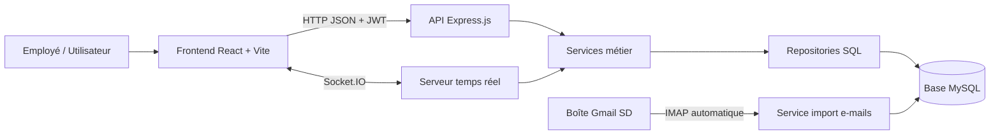
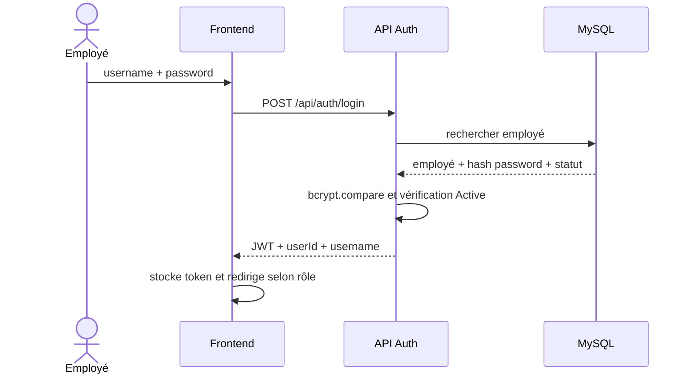
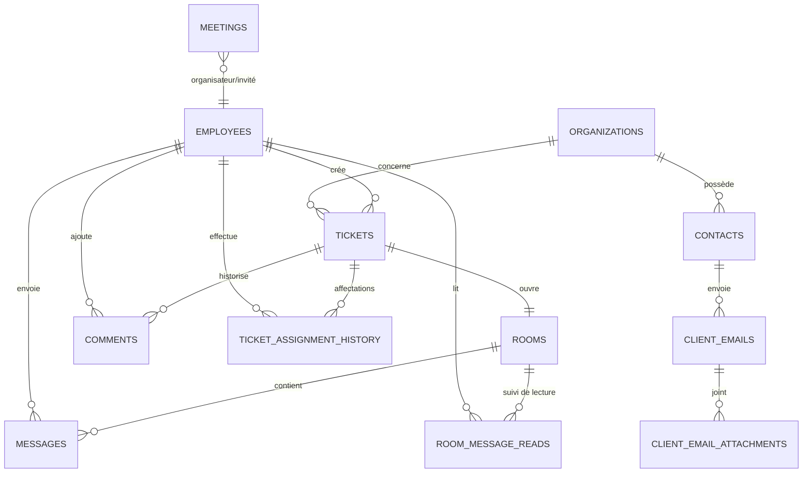
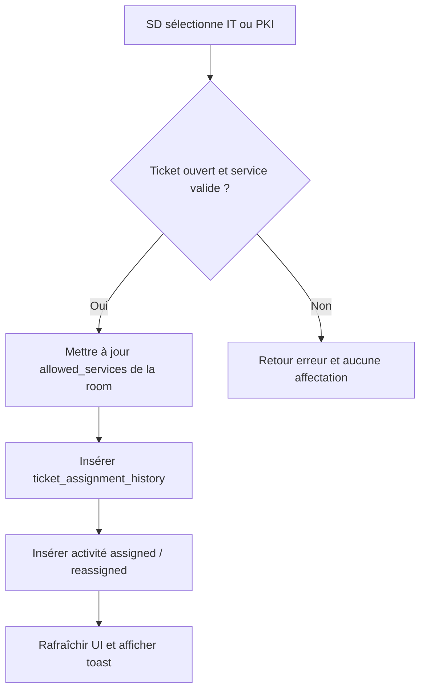
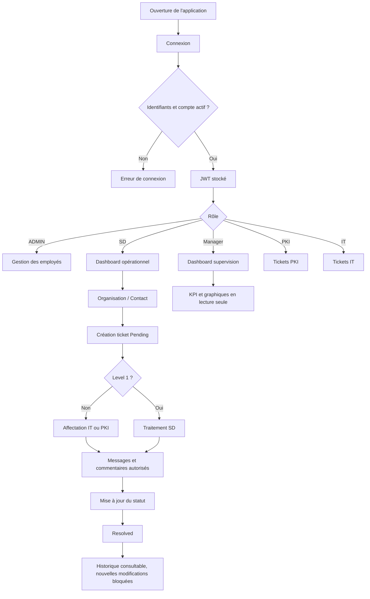

# AGCE CRM - Système de gestion de tickets et de relation client
## Résumé technique détaillé pour mémoire de fin d'études

## 1. Présentation générale du projet

AGCE CRM est une application web de gestion des demandes clients, des organisations, des contacts, des tickets techniques, des échanges d'équipe et des réunions de suivi. Elle permet d'organiser le traitement d'une demande depuis sa réception jusqu'à sa résolution, avec une séparation stricte des responsabilités selon le rôle de l'employé connecté.

L'application répond aux besoins suivants :

- centraliser les organisations et leurs contacts ;
- collecter des demandes clients, notamment à partir d'e-mails reçus ;
- créer et suivre des tickets ;
- affecter les incidents techniques aux services `IT` ou `PKI` ;
- permettre les échanges internes autour des tickets ;
- gérer des meetings et leurs décisions ;
- proposer au Manager une supervision analytique en lecture seule ;
- protéger les informations et les actions selon le rôle et l'état du compte.

Le système suit une architecture client-serveur :



## 2. Objectifs fonctionnels et acteurs

### 2.1 Acteurs principaux

| Rôle | Objectif dans l'application | Principales permissions |
|---|---|---|
| `ADMIN` | Administrer les comptes employés | Création, modification et désactivation d'employés ; dashboard admin |
| `SD` - Service Delivery | Organiser et piloter les demandes entrantes | Organisations, contacts, tickets, affectations, meetings, messages et inbox e-mail |
| `Manager` | Superviser l'activité | Dashboards, contacts, tickets, messages et meetings en lecture ; réponse à un meeting qui lui est personnellement affecté |
| `PKI` | Traiter les demandes PKI accessibles | Tickets et discussions autorisés pour son service |
| `IT` | Traiter les demandes IT accessibles | Tickets et discussions autorisés pour son service |

### 2.2 Principe de séparation des responsabilités

Le projet ne se contente pas de masquer des boutons dans l'interface. Les permissions sont contrôlées à deux niveaux :

1. Le frontend adapte les routes, le sidebar et les actions visibles.
2. Le backend vérifie le token, l'état actif de l'employé, le rôle et l'accès aux ressources avant toute opération.

Ainsi, une requête API effectuée manuellement ne doit pas permettre de contourner les restrictions affichées dans l'interface.

## 3. Téléchargements, prérequis et installations

### 3.1 Logiciels nécessaires

| Outil | Rôle dans le projet |
|---|---|
| Node.js | Environnement JavaScript permettant d'exécuter le frontend de développement et le serveur backend |
| npm | Gestionnaire de paquets ; installe les bibliothèques déclarées dans `package.json` |
| MySQL Server | Système de gestion de base de données relationnelle |
| MySQL Workbench ou client SQL équivalent | Création, consultation et administration visuelle de la base |
| Navigateur web moderne | Exécution de l'interface utilisateur |
| Git, recommandé | Gestion des versions du projet |
| Compte Gmail avec mot de passe d'application, pour l'inbox SD | Synchronisation des e-mails clients par IMAP |

Versions utilisées dans le projet : React `19`, Vite `8`, Express `5`, Socket.IO `4`, MySQL via `mysql2`.

### 3.2 Installation de Node.js et MySQL

Installer une version LTS récente de Node.js depuis le site officiel, puis vérifier :

```bash
node --version
npm --version
```

Installer MySQL Server, démarrer le service MySQL, puis créer une base dédiée, par exemple :

```sql
CREATE DATABASE agce_crm;
```

Les tables applicatives complémentaires sont initialisées au démarrage du backend par `src/database/initSchema.js`. Les tables de base historiques telles que les employés, services, organisations, contacts ou salles de meeting doivent exister dans la base initiale du projet.

### 3.3 Installation du frontend

Depuis le dossier frontend :

```bash
cd frontend_ticket_gestion
npm install
npm run dev
```

Commandes utiles :

| Commande | Utilisation |
|---|---|
| `npm run dev` | Lance le serveur de développement Vite avec rechargement rapide |
| `npm run build` | Construit la version optimisée de production |
| `npm run preview` | Prévisualise le build de production |
| `npm run lint` | Vérifie la qualité syntaxique du code React/JavaScript |

### 3.4 Installation du backend

Depuis le dossier backend :

```bash
cd backend_ticket_gestion
npm install
npm run dev
```

`npm run dev` utilise `nodemon`, qui redémarre automatiquement l'API lorsque le code backend change.

### 3.5 Variables d'environnement backend

Créer un fichier `.env` à partir de `.env.example`, sans publier les secrets :

```env
PORT=2300
JWT_SECRET=une_cle_secrete_longue_et_privee
DB_HOST=localhost
DB_NAME=agce_crm
DB_USER=utilisateur_mysql
DB_PWD=mot_de_passe_mysql

GMAIL_IMAP_USER=adresse_de_reception_sd@gmail.com
GMAIL_APP_PASSWORD=mot_de_passe_application_gmail
GMAIL_SYNC_INTERVAL_MS=60000
```

| Variable | Explication |
|---|---|
| `PORT` | Port HTTP du backend, actuellement prévu à `2300` |
| `JWT_SECRET` | Secret utilisé pour signer et vérifier les tokens de session |
| `DB_*` | Paramètres de connexion MySQL |
| `GMAIL_IMAP_USER` | Boîte e-mail surveillée pour le Service Delivery |
| `GMAIL_APP_PASSWORD` | Mot de passe d'application Gmail ; ne doit jamais être commité |
| `GMAIL_SYNC_INTERVAL_MS` | Intervalle de synchronisation automatique des e-mails |

## 4. Technologies et bibliothèques utilisées

### 4.1 Frontend

| Technologie / bibliothèque | Fonction |
|---|---|
| React | Construction de l'interface sous forme de composants réutilisables |
| Vite | Démarrage rapide, compilation et build du frontend |
| React Router DOM | Navigation et protection des routes par rôle |
| CSS global et CSS de composants | Design dashboard, modes sombre/clair et responsive |
| Tailwind CSS / utilitaires UI présents | Dépendances de style et composants réutilisables de type `shade` |
| Recharts | Graphiques des dashboards Manager et SD |
| lucide-react | Icônes professionnelles de navigation et d'action |
| react-icons | Icônes supplémentaires, notamment dans la messagerie |
| react-hot-toast | Retours de succès, erreur et information à l'utilisateur |
| Socket.IO Client | Réception et émission de messages en temps réel |
| Framer Motion | Dépendance d'animation disponible dans le projet |

### 4.2 Backend

| Technologie / bibliothèque | Fonction |
|---|---|
| Node.js | Exécution du serveur JavaScript |
| Express.js | Définition des endpoints REST et middlewares |
| MySQL2 | Connexion MySQL par pool et requêtes asynchrones `async/await` |
| JSON Web Token (`jsonwebtoken`) | Authentification sans session serveur permanente |
| bcrypt | Hachage et vérification sécurisée des mots de passe |
| dotenv | Chargement des paramètres sensibles depuis `.env` |
| cors | Autorisation des requêtes frontend vers l'API |
| Socket.IO | Rooms de discussion temps réel |
| ImapFlow | Connexion sécurisée IMAP à Gmail |
| mailparser | Lecture du sujet, du texte HTML/plain et des pièces jointes des e-mails |
| nodemon | Redémarrage automatique du serveur en développement |

### 4.3 Base de données

MySQL assure :

- la persistance des employés, organisations, contacts et tickets ;
- les relations entre tickets, rooms, messages, commentaires et meetings ;
- la traçabilité des affectations ;
- les journaux d'activité ;
- la conservation des e-mails entrants et pièces jointes ;
- le statut lu/non lu par employé pour les e-mails et les rooms de messages.

## 5. Architecture des dossiers

### 5.1 Frontend

```text
frontend_ticket_gestion/
├── src/
│   ├── App.jsx                       # Routes principales et toaster global
│   ├── main.jsx                      # Point d'entrée React et application du thème
│   ├── index.css                     # Tokens visuels globaux, dark/light mode
│   ├── assets/                       # Images et logo
│   ├── hooks/
│   │   └── useChatRoom.js            # Messagerie Socket.IO
│   ├── lib/
│   │   ├── authAccess.js             # Token, rôles et routes par défaut
│   │   └── themePreference.js        # Préférence thème par utilisateur
│   ├── pages/
│   │   ├── register/Register.jsx     # Page de connexion
│   │   └── dashboard/                # Dashboards et administration
│   └── components/
│       ├── auth/                     # RoleBasedRoute et redirections
│       └── ui/                       # Sidebar, profil, dashboards, tickets,
│                                     # messages, meetings, contacts, AccessDenied
├── package.json
└── vite.config.js
```

### 5.2 Backend

```text
backend_ticket_gestion/
├── src/
│   ├── index.js                      # Démarrage HTTP, Socket.IO, schéma et Gmail
│   ├── app.js                        # Montage des routes Express
│   ├── config/db.js                  # Pool MySQL
│   ├── database/initSchema.js        # Tables et migrations complémentaires
│   ├── middleware/
│   │   ├── auth.js                   # Vérification JWT et compte actif
│   │   └── roleCheck.js              # Autorisations par rôle et ticket
│   ├── socket/                       # Auth et événements de chat temps réel
│   ├── utils/                        # Réponses API, blacklist, accès rooms
│   └── modules/
│       ├── auth/
│       ├── employees/
│       ├── organizations/
│       ├── contacts/
│       ├── tickets/
│       ├── comments/
│       ├── rooms/
│       ├── meetings/
│       ├── meetingRooms/
│       ├── dashboard/
│       ├── activity/
│       └── clientEmails/
├── .env.example
└── package.json
```

### 5.3 Organisation backend par couche

| Couche | Rôle |
|---|---|
| `routes` | Déclare l'URL, la méthode HTTP et les middlewares de sécurité |
| `controllers` | Reçoit la requête, appelle le service et forme la réponse HTTP |
| `services` | Porte les règles métier et validations fonctionnelles |
| `repository` | Effectue les requêtes SQL vers MySQL |
| `middleware` | Intercepte une requête pour vérifier authentification ou rôle |

Cette séparation rend le code lisible : le controller ne décide pas la logique métier, et le repository ne décide pas qui est autorisé.

## 6. Concepts React employés dans le projet

### 6.1 Composants et props

Un composant React est une fonction qui retourne une interface. Les `props` sont les données transmises d'un parent à un enfant.

Exemples du projet :

- `RoleBasedRoute` reçoit `allowedRoles` et `children` pour protéger une page.
- `PKIDashboard` reçoit `initialActiveItem` afin d'ouvrir la bonne section du sidebar.
- `ConversationCard` reçoit une room, son état sélectionné et la fonction de sélection.
- `TicketDetails` reçoit l'identifiant du ticket et une action de retour.

### 6.2 `useState`

`useState` permet à un composant de mémoriser une valeur qui évolue. Quand la valeur change, React actualise l'affichage.

| Usage concret | Exemples |
|---|---|
| Formulaire | username et password de connexion, nouveau commentaire, formulaire contact |
| Navigation interne | onglet actif, room sélectionnée, ticket sélectionné |
| États asynchrones | `loading`, `error`, données chargées |
| Interface | modal ouverte, menu déroulant, thème, afficher/masquer mot de passe |

Exemple logique :

```jsx
const [loading, setLoading] = useState(true);
const [tickets, setTickets] = useState([]);
const [error, setError] = useState("");
```

Pendant une requête, `loading` affiche un état d'attente ; en succès `tickets` reçoit les données ; en erreur `error` permet d'afficher un message.

### 6.3 `useEffect`

`useEffect` exécute un traitement après le rendu ou lorsqu'une dépendance change. Il est essentiel pour charger les données depuis le backend.

Utilisations présentes :

- vérifier que l'employé connecté est toujours actif dans `RoleBasedRoute` ;
- charger le profil courant et les données du sidebar ;
- charger organisations, contacts, tickets, dashboards et meetings ;
- rejoindre une room Socket.IO lorsqu'une conversation est sélectionnée ;
- descendre automatiquement vers le nouveau message ;
- rediriger automatiquement depuis la page `Access Denied` ;
- réappliquer le thème correspondant à l'utilisateur.

Exemple de cycle :

```jsx
useEffect(() => {
  loadTickets();
}, []);
```

Un effet peut retourner une fonction de nettoyage. Dans le projet, cette pratique sert à supprimer un intervalle de vérification, arrêter un timer de redirection ou fermer un socket lors du démontage d'un composant.

### 6.4 `useRef`

`useRef` conserve une référence stable sans déclencher un nouveau rendu. Il peut pointer vers un élément HTML ou stocker une valeur technique.

Cas réels du projet :

| Élément | Utilité |
|---|---|
| `messagesAreaRef` | Défile automatiquement le fil de conversation vers le dernier message |
| `dropdownRef` / `buttonRef` | Détecte les clics extérieurs pour fermer des menus |
| `statusDropdownRef` / `roleDropdownRef` | Ferme les menus de changement de statut ou d'affectation |
| `socketRef` | Conserve la connexion Socket.IO active |
| `activeRoomRef` | Permet au callback socket de connaître la room courante sans recréer la connexion |

### 6.5 `useMemo`

`useMemo` mémorise le résultat d'un calcul jusqu'à modification de ses dépendances. Il évite de recalculer inutilement des données filtrées à chaque rendu.

Cas présents :

- filtrage de la liste des rooms par recherche ;
- détermination de la room actuellement sélectionnée ;
- filtrage et regroupement des tickets ;
- calcul des KPI du dashboard Manager ;
- détermination de la route de retour dans `AccessDenied` ;
- décodage initial de l'utilisateur dans le sidebar.

### 6.6 `useCallback`

`useCallback` mémorise une fonction. Il est utile lorsqu'une fonction devient une dépendance d'un effet ou est passée à un composant.

Cas présents :

- `joinRoom` et `sendMessage` dans `useChatRoom` ;
- `loadRooms` dans la messagerie ;
- chargement partagé contacts/organisations dans le composant Contacts.

### 6.7 Événements et affichage conditionnel

Le projet utilise :

- `onClick` : sélectionner une page, ouvrir une modal, affecter un ticket ;
- `onSubmit` : connexion ou envoi de message ;
- `onChange` : saisie de champs, choix d'un statut, filtres analytics ;
- conditions JSX : afficher un bouton uniquement pour SD, bloquer l'édition Manager, afficher un état vide, loading ou error ;
- classes conditionnelles : couleur de statut, room non lue, onglet actif, mode clair/sombre.

## 7. Routing frontend et accès selon le rôle

### 7.1 Routes principales

| Route | Accès |
|---|---|
| `/login` et `/` | Connexion |
| `/admin` | `ADMIN` |
| `/service-delivery/dashboard` | `SD` |
| `/service-delivery/contacts` | `SD` |
| `/service-delivery/create-ticket` | `SD` |
| `/service-delivery/tickets`, `/messages`, `/meetings` | `SD` |
| `/manager/dashboard`, `/contacts`, `/tickets`, `/messages`, `/meetings` | `Manager` |
| `/pki/tickets`, `/pki/messages`, `/pki/meetings`, `/pki/dashboard` | `PKI` |
| `/it/tickets`, `/it/messages`, `/it/meetings`, `/it/dashboard` | `IT` |
| `/ProfilePage` | Tout employé authentifié autorisé |

### 7.2 Route protégée

`RoleBasedRoute` :

1. lit le JWT du `localStorage` ;
2. vérifie son expiration ;
3. appelle `GET /api/employees/me` pour confirmer que le compte existe et reste actif ;
4. compare le rôle courant aux rôles autorisés ;
5. retourne la page voulue, la page `AccessDenied` ou le login.

La vérification de compte actif est répétée périodiquement. Un employé désactivé pendant sa session perd l'accès et est redirigé.

### 7.3 Redirection par rôle

| Rôle | Page d'arrivée |
|---|---|
| SD | `/service-delivery/dashboard` |
| Manager | `/manager/dashboard` |
| PKI | `/pki/tickets` |
| IT | `/it/tickets` |
| ADMIN | `/admin` |
| Rôle absent ou invalide | `/login` |

### 7.4 Page Access Denied

Lorsqu'un utilisateur saisit manuellement une URL interdite :

- la page demandée n'est pas rendue ;
- une page professionnelle `Access Denied` est affichée ;
- le message indique que le rôle ne dispose pas de la permission ;
- un bouton retourne vers la section autorisée ;
- une redirection automatique s'effectue après cinq secondes.

## 8. Authentification et sécurité

### 8.1 Connexion

Flux de connexion :



Le mot de passe n'est jamais sauvegardé en clair : `bcrypt.hash(..., 10)` est utilisé lors de la création ou modification d'un employé.

### 8.2 JWT

Le JWT contient :

- l'identifiant de l'employé ;
- son username ;
- son service/rôle ;
- une durée d'expiration de sept jours.

Pour chaque route sécurisée, le frontend envoie :

```http
Authorization: Bearer <token>
```

Le middleware backend `auth.js` :

1. vérifie la présence du token ;
2. refuse un token blacklisté après logout ;
3. vérifie la signature et l'expiration ;
4. recharge l'employé en base ;
5. refuse tout employé dont le statut n'est pas `Active`.

### 8.3 Logout

Au logout :

- le token est envoyé au backend et ajouté à la blacklist en mémoire ;
- les données d'authentification locales sont retirées ;
- la préférence de thème propre à l'utilisateur peut être conservée ;
- un toast de confirmation s'affiche ;
- l'utilisateur revient à la page de connexion.

### 8.4 Rôles et middlewares backend

| Middleware | But |
|---|---|
| `requireServiceDelivery` | Autorise uniquement `SD` |
| `requireManager` | Autorise uniquement `Manager` |
| `requireServiceDeliveryOrManager` | Lecture partagée SD/Manager |
| `requireTicketAccess` | Vérifie l'accès à un ticket : SD/Manager global, PKI/IT selon affectation |
| `blockResolvedTicket` | Refuse toute modification d'un ticket déjà résolu |

Les erreurs d'autorisation répondent avec le code `403` et un message clair :

```json
{
  "success": false,
  "message": "Access denied. Your role does not have permission to view this section."
}
```

## 9. Modèle de données MySQL

### 9.1 Tables essentielles

| Table | Rôle | Relations principales |
|---|---|---|
| `employees` | Employés et identifiants de connexion | Référence un service ; utilisé comme créateur ou auteur |
| `organizations` | Entreprises clientes | Liée à plusieurs contacts et tickets |
| `contacts` | Personnes de contact clientes | Liée à une organisation |
| `tickets` | Demandes de support | Organisation, créateur employé |
| `rooms` | Conversation liée à un ticket | Une room unique par ticket |
| `messages` | Messages temps réel d'une room | Room et employé auteur |
| `room_message_reads` | Dernier message lu par employé dans une room | Room + employé, clé primaire composée |
| `comments` | Commentaires historisés d'un ticket | Ticket et employé auteur |
| `ticket_assignment_history` | Historique IT/PKI | Ticket et employé ayant affecté |
| `meetings` | Réunions organisées | Organisateur, invité, ticket, salle |
| `activity_logs` | Actions importantes du système | Auteur et entité concernée |
| `client_emails` | E-mails clients admis dans l'inbox SD | Contact existant |
| `client_email_attachments` | Pièces jointes e-mail | E-mail parent |
| `client_email_reads` | Lecture individuelle d'un e-mail | E-mail + employé |

### 9.2 Ticket et statuts

La table `tickets` possède les états autorisés :

| Statut | Signification |
|---|---|
| `Pending` | Ticket créé et en attente de traitement ou d'affectation |
| `In Progress` | Travail en cours |
| `Warning` | Situation nécessitant une surveillance |
| `Critical` | Incident urgent |
| `Resolved` | Ticket définitivement clôturé |

Un nouveau ticket a automatiquement le statut `Pending`. Les valeurs `Open` et `Opened` sont normalisées ou refusées.

### 9.3 Relations principales



## 10. API REST et communication frontend/backend

### 10.1 Format général

Le frontend utilise `fetch()` avec JSON :

```js
fetch("http://localhost:2300/api/tickets", {
  headers: { Authorization: `Bearer ${token}` }
});
```

Réponse réussie standard :

```json
{
  "success": true,
  "message": "Tickets loaded successfully",
  "data": []
}
```

Réponse échouée standard :

```json
{
  "success": false,
  "message": "Access denied",
  "error": "Access denied"
}
```

### 10.2 Endpoints importants

| Méthode et endpoint | Fonction | Sécurité principale |
|---|---|---|
| `POST /api/auth/login` | Connexion | Identifiants valides et compte actif |
| `POST /api/auth/logout` | Déconnexion | Token à blacklister |
| `GET /api/employees/me` | Profil courant | Authentifié et actif |
| `POST /api/employees/InsertEmp` | Créer un employé | SD ou ADMIN selon routes actuelles |
| `PUT /api/employees/EditEmp/:id` | Modifier/désactiver | SD ou ADMIN |
| `GET /api/organizations` | Lister organisations | SD ou Manager |
| `POST/PUT/DELETE /api/organizations...` | CRUD organisation | SD |
| `GET /api/contacts` | Lister contacts | SD ou Manager |
| `POST/PUT/DELETE /api/contacts...` | CRUD contact | SD |
| `POST /api/tickets` | Créer ticket Pending | SD |
| `GET /api/tickets` | Lister tickets accessibles | Authentifié, filtré par service |
| `GET /api/tickets/:ticketId` | Détails ticket | Accès ticket |
| `PUT /api/tickets/:ticketId/assign` | Affecter à IT/PKI | SD, non résolu |
| `PUT /api/tickets/:ticketId/status` | Modifier statut | SD, non résolu |
| `GET /api/tickets/:ticketId/comments` | Lire commentaires | Accès ticket, même résolu |
| `POST /api/tickets/:ticketId/comments` | Ajouter commentaire | Accès ticket, non résolu |
| `GET /api/rooms` | Rooms de discussion accessibles | Authentifié, room ouverte |
| `PATCH /api/rooms/:roomId/read` | Marquer messages lus | Accès room |
| `GET/POST/PUT/DELETE /api/meetings` | Gestion réunion | Lecture selon accès ; création/suppression SD |
| `GET /api/dashboard/manager` | Analytics générales Manager | Manager |
| `GET /api/dashboard/manager/analytics` | Analytics avec filtre temporel | Manager |
| `GET /api/dashboard/sd` | Vue opérationnelle SD | SD |
| `GET /api/client-emails` | Inbox e-mail partagée | SD |
| `PATCH /api/client-emails/:emailId/read` | Marquer e-mail lu | SD |

### 10.3 Cycle d'une opération CRUD

Exemple de création d'une organisation :

1. L'utilisateur SD remplit le formulaire.
2. Le frontend valide les champs principaux et envoie un `POST` avec le JWT.
3. Le middleware backend contrôle la session et le rôle SD.
4. Le service vérifie le nom, l'industrie, l'e-mail et le téléphone.
5. Le repository exécute un `INSERT` MySQL.
6. Le backend retourne l'organisation créée avec `201`.
7. Le frontend affiche un toast de succès et recharge les listes.
8. En erreur, aucun changement n'est affiché comme réussi et un toast explicite apparaît.

## 11. Flux métier détaillés avec succès et échecs

### 11.1 Connexion d'un employé

| Cas | Déroulement |
|---|---|
| Succès | Le username existe, le hash correspond, le compte est `Active`. Le backend génère un JWT, le frontend le conserve et redirige vers le dashboard du rôle. |
| Identifiants invalides | Réponse `401`, message `Invalid credential`, aucun token sauvegardé. |
| Compte désactivé | Réponse `403`, message indiquant que le compte est inactif, accès impossible. |
| Session expirée/invalide | Le frontend ou le middleware détecte l'erreur, efface l'authentification et retourne au login. |

### 11.2 Création d'une organisation

Autorisation : Service Delivery.

Validations :

- nom obligatoire ;
- secteur/industrie obligatoire ;
- e-mail au format valide ;
- numéro de téléphone composé exactement de 10 chiffres ;
- statut, s'il est fourni, limité à `Active` ou `Inactive`.

| Succès | Échec |
|---|---|
| Insertion MySQL, retour de l'organisation, rafraîchissement de la liste et toast de création. | Champs manquants, format invalide, utilisateur non SD, erreur serveur ou session invalide. |

Contrainte de suppression : une organisation ne peut pas être supprimée si des contacts y sont encore attachés.

### 11.3 Création d'un contact

Autorisation : Service Delivery ; le Manager consulte uniquement.

Validations :

- nom, type, e-mail et téléphone obligatoires ;
- e-mail valide ;
- téléphone exactement à 10 chiffres ;
- type autorisé, par exemple `Applicant`, `Representative` ou `LRAO` ;
- statut parmi `Active`, `Inactive`, `Pending`.

La page détail d'une organisation permet d'associer le contact à cette organisation et de gérer ses rôles.

| Succès | Échec |
|---|---|
| Contact associé et affiché dans le tableau de l'organisation. | Type invalide, e-mail/téléphone invalide, champ manquant, action interdite au Manager, contact inexistant lors d'une modification. |

### 11.4 Création et gestion d'un employé

Autorisation des routes actuelles : `ADMIN` et `SD`.

Validations de création :

- prénom, nom, e-mail, username, mot de passe et service obligatoires ;
- username commençant par une lettre et ne contenant que lettres, chiffres ou `_` ;
- mot de passe de huit caractères minimum avec majuscule, minuscule, chiffre et caractère spécial ;
- username unique.

| Succès | Échec |
|---|---|
| Mot de passe haché avec bcrypt, employé inséré et disponible pour connexion si actif. | Username déjà existant, mot de passe faible, e-mail invalide ou permission refusée. |

Désactivation : lorsque l'état passe à `Inactive`, les sockets de l'employé sont déconnectés et toute prochaine vérification/connexion est refusée.

### 11.5 Création d'un ticket

Autorisation : Service Delivery.

Champs requis :

- application ;
- type de problème ;
- niveau de problème ;
- description.

Flux de succès :

1. Un code demande de type `REQ-année-numéro` est généré ou utilisé.
2. Le ticket est inséré avec le statut `Pending`.
3. Une room associée est créée.
4. Les rôles autorisés initialement sont calculés selon le type et niveau.
5. Une activité `ticket_created` est journalisée.
6. Le frontend affiche : `Ticket created successfully with status Pending`.

Cas particulier : un ticket `Level 1 Assistance` relève directement de SD et n'a pas à être affecté à IT ou PKI.

Échecs possibles :

- champ obligatoire absent ;
- token manquant ou expiré ;
- rôle autre que SD ;
- problème MySQL ou serveur.

### 11.6 Affectation d'un ticket

Autorisation : Service Delivery.

Règles :

- seuls `IT` et `PKI` sont des services d'affectation acceptés ;
- un ticket Level 1 Assistance ne peut pas être affecté ;
- un ticket résolu est définitivement verrouillé ;
- chaque affectation ou réaffectation crée un enregistrement d'historique.

Flux de succès :



Échecs possibles :

- `Invalid team assignment. Allowed teams are IT or PKI.`;
- ticket introuvable ;
- ticket Level 1 traité par SD ;
- ticket déjà résolu ;
- permission refusée.

### 11.7 Changement de statut et résolution

Statuts acceptés : `Pending`, `In Progress`, `Warning`, `Critical`, `Resolved`.

Règles importantes :

- `Open` et `Opened` sont interdits ;
- après passage à `Resolved`, le ticket ne peut plus être modifié ni rouvert ;
- dans l'implémentation actuelle, la route de changement de statut est réservée à SD.

| Succès | Échec |
|---|---|
| Le statut est mis à jour et l'activité correspondante est enregistrée ; pour `Resolved`, l'interface confirme la résolution. | Statut invalide, tentative de réouverture/modification d'un ticket résolu, rôle non autorisé ou ticket absent. |

### 11.8 Commentaires sur ticket

Les commentaires représentent l'historique de travail attaché au ticket.

Règles :

- un utilisateur doit avoir accès au ticket ;
- les commentaires existants restent visibles même lorsque le ticket est résolu ;
- un ticket résolu ne peut plus recevoir de nouveau commentaire ;
- un service IT/PKI ne peut commenter que les tickets affectés à son service ; SD peut superviser les tickets qu'il traite.

| Succès | Échec |
|---|---|
| Le commentaire est inséré et rechargé dans l'historique. Aucun toast de succès inutile n'est requis pour préserver une interface calme. | Commentaire vide, ticket résolu, service sans accès, ticket introuvable. |

### 11.9 Messages internes temps réel

Chaque ticket ouvert dispose d'une room de conversation autorisée aux services concernés.

Fonctionnement :

1. Le composant React utilise le hook `useChatRoom`.
2. Le socket s'authentifie par JWT.
3. L'utilisateur rejoint une room autorisée.
4. L'historique est chargé.
5. L'envoi est inséré en base et diffusé en temps réel par Socket.IO.
6. Le fil se positionne automatiquement sur le dernier message reçu ou envoyé.
7. Le compteur non lu est conservé individuellement dans `room_message_reads`.

| Succès | Échec |
|---|---|
| Message diffusé à tous les membres autorisés présents dans la room ; compteur mis à jour pour les non lecteurs. | Socket non connecté, room interdite, compte inactif, ticket résolu ou message vide. |

Remarque : les rooms de tickets résolus sont masquées/lecture bloquée par le service de rooms actuel, tandis que l'historique des commentaires reste consultable.

### 11.10 Inbox d'e-mails clients Service Delivery

Objectif : centraliser les messages reçus des clients déjà enregistrés dans la base, avec leurs pièces jointes.

Fonctionnement :

- la boîte Gmail configurée est interrogée automatiquement par IMAP ;
- la synchronisation s'exécute par défaut toutes les 60 secondes ;
- `mailparser` extrait expéditeur, sujet, contenu et pièces jointes ;
- seul un expéditeur dont l'adresse correspond à un contact existant est accepté ;
- les doublons sont bloqués par `source_message_id` ;
- les fichiers/images, dans la limite configurée de 10 Mo par pièce jointe importée, sont disponibles à l'affichage/téléchargement ;
- les e-mails sont partagés avec l'équipe SD et leur lecture est individuelle.

| Succès | Échec / exclusion |
|---|---|
| E-mail enregistré avec le contact, l'organisation, le téléphone, l'objet, la date et les pièces jointes. | Expéditeur inconnu ignoré, doublon ignoré, configuration Gmail absente, date ou e-mail invalide, erreur IMAP. |

### 11.11 Meetings

Principes :

- SD crée et gère les réunions ;
- une réunion peut être affectée à un invité ;
- le Manager peut consulter les réunions visibles et accepter/rejeter seulement celle qui lui est affectée ;
- plus généralement, le backend permet la réponse de l'invité affecté ;
- en cas de rejet, le motif est obligatoire.

Validations :

- titre, début et fin obligatoires ;
- date/heure valide ;
- heure de fin postérieure au début ;
- statuts acceptés : `Pending`, `Accepted`, `Rejected` ;
- une décision déjà enregistrée ne peut pas être répétée par l'invité.

| Succès | Échec |
|---|---|
| Création en `Pending`, ou décision sauvegardée avec éventuel motif de rejet. | Motif de rejet absent, utilisateur non invité, date incohérente, décision déjà prise ou accès refusé. |

## 12. Dashboards et statistiques

### 12.1 Dashboard Service Delivery

Le dashboard SD est opérationnel. Il consomme `GET /api/dashboard/sd` et peut présenter :

- total de tickets ;
- tickets pending, warning, critical et resolved ;
- tickets affectés IT ou PKI ;
- tickets en attente d'affectation ;
- tickets récents et retardés ;
- résumé organisations/contacts ;
- file des tickets à affecter ;
- activité liée à la gestion des demandes.

Les actions SD conduisent vers la création d'organisation, de contact et de ticket, ou vers les pages de suivi.

### 12.2 Dashboard Manager

Le Manager dispose d'une interface de supervision, sans boutons CRUD. Deux vues sont proposées :

| Vue | Données |
|---|---|
| `General` | KPI courants, distribution des statuts, tickets créés/résolus, distribution des affectations et synthèse d'activité |
| `Details` | Analytics filtrées par année, mois, semaine ou jour, graphiques de volume, résolution, catégories et activité agent |

Endpoints :

- `GET /api/dashboard/manager`
- `GET /api/dashboard/manager/analytics?period=monthly&year=2026&month=5`, selon le filtre choisi.

### 12.3 Calculs provenant de la base

Les données ne sont pas de simples nombres fictifs. Le repository du dashboard réalise des requêtes SQL :

- comptage des statuts et niveaux de tickets ;
- tickets créés et résolus par période ;
- temps moyens basé sur dates de création, mise à jour et première affectation ;
- organisations et contacts créés ;
- file d'attente d'affectation ;
- employés ayant créé, commenté ou affecté ;
- historique et distribution des traitements.

### 12.4 États d'interface

Les dashboards traitent :

- `loading` : affichage d'un état de chargement ;
- `success` : cartes et graphiques alimentés ;
- `empty state` : absence de données présentée clairement ;
- `error` : erreur API avec possibilité de relancer ou message utilisateur.

## 13. Design, thème et expérience utilisateur

L'interface suit un langage dashboard :

- sidebar adapté au rôle ;
- cartes et tableaux organisés ;
- toasts globaux positionnés en haut à droite ;
- boutons d'action affichés ou désactivés selon les droits ;
- badges de statut ;
- formulaires validés ;
- pages `Access Denied`, loading et error.

### 13.1 Mode sombre et mode clair

Le mode visuel est géré par des variables CSS globales dans `index.css`.

- Le thème sombre correspond à l'identité dashboard premium initiale.
- Le thème clair utilise des fonds et cartes blancs.
- Le choix est stocké par employé grâce à une clé locale dérivée de son identité JWT.
- Le choix d'un utilisateur ne change donc pas l'interface des autres employés.

## 14. Flux global complet de l'application

### 14.1 Parcours normal



### 14.2 Circulation d'une donnée

1. L'utilisateur déclenche un événement React : clic ou soumission.
2. Le composant vérifie l'état local et construit les données JSON.
3. `fetch()` transmet la requête avec le JWT.
4. Express reçoit la requête.
5. `auth` vérifie le token et l'état actif.
6. `roleCheck` ou `requireTicketAccess` vérifie la permission.
7. Le controller délègue au service.
8. Le service valide la règle métier.
9. Le repository exécute la requête MySQL.
10. Le controller retourne une réponse normalisée.
11. Le frontend met à jour son état React, recharge les données utiles et affiche un feedback adapté.

## 15. Gestion générale des réussites et erreurs

| Situation | Comportement attendu de l'interface | Code HTTP typique |
|---|---|---|
| Chargement réussi | Données affichées | `200` |
| Création réussie | Toast court et rafraîchissement | `201` |
| Modification / affectation réussie | Toast puis données actualisées | `200` |
| Données invalides | Toast d'erreur avec règle à corriger | `400` |
| Token absent / authentification refusée | Retour login | `401` |
| Compte inactif ou accès rôle interdit | Login ou Access Denied | `403` |
| Ressource inexistante | État introuvable | `404` |
| Erreur serveur/base | Message problème serveur | `500` |

Exemples de feedback utiles :

- `Ticket created successfully with status Pending`
- `Ticket assigned successfully to IT`
- `Ticket resolved successfully.`
- `Cannot add comment because the ticket is resolved.`
- `Cannot reopen a resolved ticket.`
- `Your account is inactive. Please contact an administrator.`
- `Access denied. Your role does not have permission to view this section.`

## 16. Points de qualité et points de vigilance

### 16.1 Qualités techniques réalisées

- architecture séparée frontend/backend/base de données ;
- validation backend en complément de l'interface ;
- JWT et bcrypt pour l'authentification ;
- compte inactif bloqué à la connexion et pendant une session ;
- rôles et page Access Denied ;
- ticket `Pending` par défaut et verrouillage après résolution ;
- messages temps réel avec compteur non lu ;
- réception automatisée d'e-mails SD filtrés par clients existants ;
- dashboards calculés depuis MySQL ;
- thème clair/sombre individualisé par employé.

### 16.2 Points à connaître lors de la présentation

Ces points correspondent au comportement actuel lu dans le code et peuvent être mentionnés comme décisions ou améliorations futures :

- la modification du statut d'un ticket est actuellement exposée par une route réservée à SD ; si IT/PKI doivent résoudre eux-mêmes leurs tickets, cette permission doit être élargie de manière contrôlée ;
- l'historique d'affectation est destiné à la supervision Manager dans l'interface, mais l'endpoint d'historique est actuellement protégé par accès au ticket plutôt que strictement réservé au Manager ;
- les commentaires d'un ticket résolu restent consultables, tandis que les rooms de messages résolus sont actuellement masquées/verrouillées ;
- la blacklist de logout est gérée en mémoire serveur : un stockage persistant ou une politique de tokens courts serait recommandé dans un déploiement industriel ;
- les secrets Gmail et JWT doivent rester uniquement en variables d'environnement.

## 17. Conclusion

AGCE CRM constitue une application complète de gestion de relation client et de tickets, organisée autour de la sécurité, de la traçabilité et de la séparation des rôles. Son frontend React fournit une interface dynamique et responsive ; son backend Express applique les règles métier et communique avec MySQL ; Socket.IO apporte le temps réel ; l'intégration Gmail permet la collecte contrôlée de demandes clients déjà reconnus.

Le cycle complet est cohérent : authentifier l'employé, vérifier son droit d'accès, enregistrer la demande, affecter le traitement, échanger, superviser et clôturer définitivement un ticket. Cette organisation rend le projet compréhensible pour un jury et constitue une base solide pour une application professionnelle de support et de CRM.

## 18. Fichiers sources de référence pour le mémoire

| Sujet | Fichier principal |
|---|---|
| Entrée et routes frontend | `frontend_ticket_gestion/src/App.jsx`, `src/main.jsx` |
| Design global | `frontend_ticket_gestion/src/index.css` |
| Auth frontend | `frontend_ticket_gestion/src/components/auth/RoleBasedRoute.jsx`, `src/lib/authAccess.js` |
| Sidebar par rôle | `frontend_ticket_gestion/src/components/ui/SideBar.jsx` |
| Tickets | `frontend_ticket_gestion/src/components/ui/DashboardComposentes/Tickets/`, `backend_ticket_gestion/src/modules/tickets/` |
| Messagerie | `frontend_ticket_gestion/src/components/ui/DashboardComposentes/Messages.jsx`, `src/hooks/useChatRoom.js`, `backend_ticket_gestion/src/socket/` |
| Meetings | `frontend_ticket_gestion/src/components/ui/DashboardComposentes/Meetings.tsx`, `backend_ticket_gestion/src/modules/meetings/` |
| Dashboards | `frontend_ticket_gestion/src/components/ui/Dashboard/`, `backend_ticket_gestion/src/modules/dashboard/` |
| Inbox e-mail | `backend_ticket_gestion/src/modules/clientEmails/`, `frontend_ticket_gestion/src/components/ui/DashboardComposentes/CreateTicket.jsx` |
| Schéma complémentaire DB | `backend_ticket_gestion/src/database/initSchema.js` |
| Sécurité backend | `backend_ticket_gestion/src/middleware/auth.js`, `src/middleware/roleCheck.js` |

