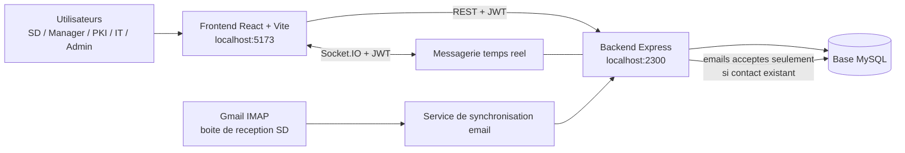
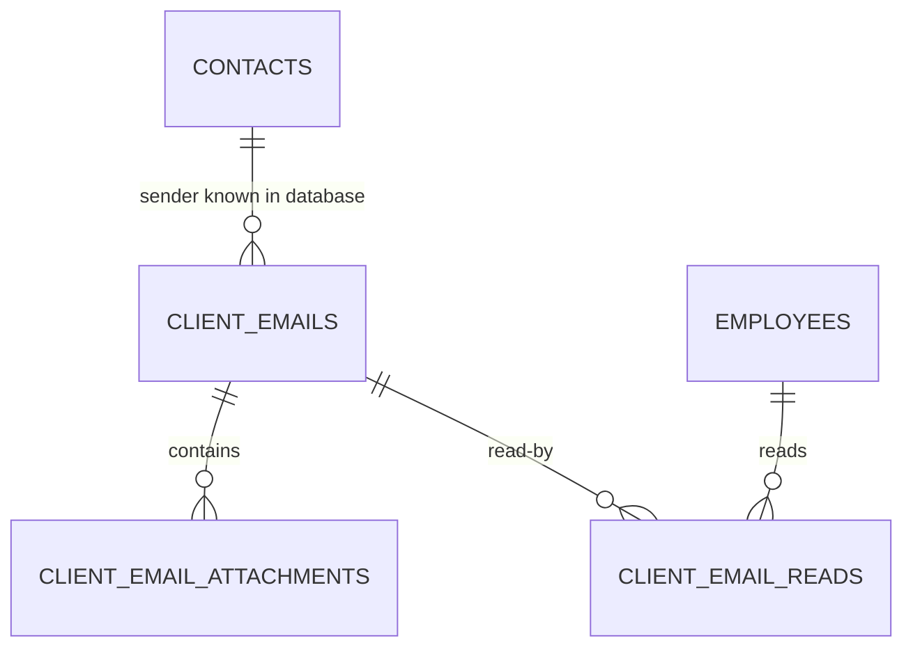

# AGCE CRM - Documentation technique et fonctionnelle complete

## 1. Presentation du projet

**AGCE CRM - Support System** est une application web de gestion de tickets, de
contacts clients, de communications et de meetings. Elle organise le traitement
des demandes entre quatre fonctions operationnelles :

- **Service Delivery (SD)** : reception, creation, qualification et orientation
  des demandes.
- **Manager** : supervision et analyse des performances, avec validation ou
  rejet uniquement des meetings auxquels il est invite.
- **PKI** : traitement des tickets affectes au service PKI.
- **IT** : traitement des tickets affectes au service IT.

Une interface **ADMIN** existe egalement dans l'application pour l'espace
d'administration historique.

Le projet comprend :

- un frontend SPA React pour l'interface utilisateur ;
- une API REST Express pour la logique metier et la securite ;
- Socket.IO pour les messages temps reel ;
- MySQL pour les donnees applicatives et la tracabilite ;
- une synchronisation IMAP Gmail pour recevoir les emails des clients connus
  dans une boite partagee Service Delivery.

## 2. Architecture globale



### Principe de securite

Le frontend controle l'affichage et la navigation, mais l'autorite finale reste
le backend. Une page cachee dans le sidebar ne suffit jamais : chaque route API
sensible applique l'authentification JWT et le controle du service autorise.

## 3. Organisation du depot

```text
full_stuck_ticket_gestion/
|-- package.json                       # Demarrage simultane frontend/backend
|-- backend_ticket_gestion/
|   |-- package.json                   # Dependances serveur
|   `-- src/
|       |-- index.js                   # HTTP server, schema, Socket.IO
|       |-- app.js                     # Montage des routes Express
|       |-- config/db.js               # Connexion MySQL
|       |-- database/initSchema.js     # Tables et migrations au demarrage
|       |-- middleware/                # JWT et controle des roles
|       |-- modules/                   # Auth, tickets, CRM, dashboard, emails...
|       |-- socket/                    # Authentification/messagerie Socket.IO
|       `-- utils/                     # Reponses API, acces rooms, blacklist
`-- frontend_ticket_gestion/
    |-- package.json                   # Dependances React
    |-- vite.config.js                 # Vite, React, Tailwind, alias @
    `-- src/
        |-- App.jsx                    # Router et Toaster global
        |-- components/auth/           # Protection des routes par role
        |-- components/ui/             # Sidebar, dashboards, pages metier
        |-- hooks/                     # Connexion chat temps reel
        |-- lib/authAccess.js          # Session, role, routes d'accueil
        `-- index.css                  # Design system global
```

## 4. Technologies et outils utilises

### 4.1 Socle general

| Technologie / outil | Role dans le projet |
| --- | --- |
| Node.js | Runtime JavaScript du frontend tooling et du backend |
| npm | Gestion des paquets et scripts |
| concurrently | Lance frontend et backend ensemble depuis la racine |
| Git | Versionnement du code |
| MySQL | Stockage relationnel persistant |
| JSON | Echanges de donnees API et colonnes de metadonnees |

### 4.2 Frontend

| Package | Utilisation |
| --- | --- |
| React 19 | Construction des composants et etats UI |
| React DOM | Rendu de l'application dans le navigateur |
| Vite 8 | Serveur de developpement et build frontend |
| React Router DOM 7 | Routing, routes protegees et redirections |
| Tailwind CSS 4 / plugin Vite | Utilitaires de style disponibles |
| CSS local et `index.css` | Design glassmorphism sombre et styles metier |
| Recharts | Graphiques des dashboards |
| react-hot-toast | Notifications globales positionnees en haut a droite |
| lucide-react / react-icons | Iconographie de l'interface |
| Socket.IO Client | Messages temps reel |
| Framer Motion | Animations d'interface disponibles |
| Radix UI / shadcn / CVA / clsx / tailwind-merge | Composants et composition de styles |
| Geist Variable Font | Typographie moderne de l'application |
| ESLint | Controle qualite JavaScript/React |

### 4.3 Backend

| Package | Utilisation |
| --- | --- |
| Express 5 | Serveur API REST et middlewares |
| mysql2 | Pool de connexions et requetes MySQL asynchrones |
| jsonwebtoken | Generation et verification des JWT |
| bcrypt | Hash/verification des mots de passe |
| cors | Autorisation des appels du frontend |
| dotenv | Chargement des variables d'environnement |
| Socket.IO | Communication messages temps reel |
| ImapFlow | Lecture securisee de la boite Gmail via IMAP |
| mailparser | Extraction du contenu et des pieces jointes des emails |
| nodemon | Redemarrage automatique du serveur en developpement |

## 5. Prerequis d'installation

Installer avant de demarrer le projet :

1. **Node.js** version LTS recente, avec `npm`.
2. **MySQL Server** actif localement ou sur un serveur accessible.
3. Une base MySQL vide ou existante dediee au projet.
4. Pour la reception Gmail : un compte Gmail de boite de reception et un
   **App Password** Google, uniquement en environnement local/serveur.

Verification rapide :

```bash
node --version
npm --version
mysql --version
```

## 6. Installation de A a Z

### 6.1 Installer les dependances

Depuis le dossier racine :

```bash
cd /Users/issamouladsmane/Desktop/full_stuck_ticket_gestion
npm install
cd backend_ticket_gestion
npm install
cd ../frontend_ticket_gestion
npm install
cd ..
```

Les trois installations sont necessaires :

- racine : orchestration simultanee ;
- backend : API, MySQL, IMAP et Socket.IO ;
- frontend : React, charts, routing et interface.

### 6.2 Creer et configurer la base MySQL

Exemple MySQL :

```sql
CREATE DATABASE ticket_gestion CHARACTER SET utf8mb4 COLLATE utf8mb4_unicode_ci;
```

Les tables metier supplementaires sont initialisees/mises a niveau par le
backend au demarrage via `src/database/initSchema.js`. Les tables de base comme
les employes, services, organisations et contacts doivent deja etre disponibles
si elles ne font pas partie d'un script d'initialisation externe.

### 6.3 Configurer le backend

Creer `backend_ticket_gestion/.env` a partir des variables suivantes :

```dotenv
PORT=2300

DB_HOST=localhost
DB_USER=<mysql_user>
DB_PWD=<mysql_password>
DB_NAME=ticket_gestion

JWT_SECRET=<long_random_secret_for_jwt_signing>

# Optionnel : reception des emails clients dans la boite SD.
GMAIL_IMAP_USER=<service_delivery_inbox@gmail.com>
GMAIL_APP_PASSWORD=<google_app_password>
```

**Regles de securite importantes :**

- ne jamais committer `.env` ;
- ne jamais afficher `JWT_SECRET`, `DB_PWD` ou `GMAIL_APP_PASSWORD` dans une
  capture, une documentation ou une demonstration ;
- utiliser une valeur JWT longue et aleatoire ;
- revoquer puis regenerer tout App Password Gmail partage dans une conversation
  ou expose pendant un test.

### 6.4 Configurer le frontend

Le frontend fonctionne par defaut avec l'API locale sur le port `2300`. Pour
changer l'adresse du serveur, creer `frontend_ticket_gestion/.env` :

```dotenv
VITE_API_URL=http://localhost:2300/api
```

### 6.5 Demarrer en developpement

Demarrage complet depuis la racine :

```bash
npm run dev
```

Ou demarrage separe :

```bash
npm run dev:backend
npm run dev:frontend
```

Adresses locales :

| Composant | URL |
| --- | --- |
| Frontend Vite | `http://localhost:5173` |
| API backend | `http://localhost:2300` |
| Verification API | `http://localhost:2300/test` |

### 6.6 Build et controles frontend

```bash
cd frontend_ticket_gestion
npm run lint
npm run build
npm run preview
```

`npm run build` produit le dossier `dist/` pour le deploiement frontend.

## 7. Authentification, session et controle d'acces

### 7.1 Authentification

- L'utilisateur se connecte via `POST /api/auth/login`.
- Le backend emet un JWT qui contient l'identite et le service de l'utilisateur.
- Un employe dont le statut est `Inactive` ne peut pas obtenir de session,
  meme si son identifiant et son mot de passe sont corrects.
- Le frontend stocke le token dans `localStorage` et l'envoie dans les requetes :

```http
Authorization: Bearer <token>
```

- `auth.js` verifie le token, sa validite et sa blacklist.
- Pour chaque appel protege, `auth.js` relit aussi le statut actuel de
  l'employe : une desactivation administrative bloque immediatement les API
  meme si un token avait deja ete emis.
- Lors du logout, le token est retire du stockage local ; la notification de
  deconnexion utilise le Toaster global.

### 7.2 Protection frontend

`RoleBasedRoute` :

- detecte l'absence ou l'expiration du token et redirige vers `/login` ;
- verifie que le compte reste actif avant d'afficher une section protegee et
  controle periodiquement une session deja affichee ;
- compare le role normalise a la liste autorisee ;
- affiche la page **Access Denied** si le role n'a pas acces ;
- empeche le rendu d'une page non autorisee.

`RoleRedirect` envoie l'utilisateur vers sa section par defaut :

| Role | Route d'accueil |
| --- | --- |
| SD | `/service-delivery/dashboard` |
| Manager | `/manager/dashboard` |
| PKI | `/pki/tickets` |
| IT | `/it/tickets` |
| ADMIN | `/admin` |
| Inconnu / sans session | `/login` |

### 7.3 Protection backend

Le middleware `roleCheck.js` normalise les roles et fournit les gardes :

- `requireServiceDelivery`
- `requireManager`
- `requirePKI`
- `requireIT`
- `requireAdmin`
- `requireServiceDeliveryOrManager`
- `requireTicketAccess`
- `blockResolvedTicket`

Lorsqu'une operation est interdite, l'API retourne une erreur HTTP adaptee,
notamment `401` pour authentification manquante, `403` pour acces refuse et
`400` pour action metier invalide.

Message d'acces interdit standard :

```json
{
  "success": false,
  "message": "Access denied. Your role does not have permission to view this section."
}
```

## 8. Matrice des roles et permissions

| Fonctionnalite | Service Delivery | Manager | PKI | IT | ADMIN |
| --- | --- | --- | --- | --- | --- |
| Dashboard propre au role | Oui | Oui | Oui | Oui | Espace admin |
| Consulter tous les tickets | Oui | Oui | Non | Non | Selon interface admin |
| Consulter tickets affectes a son service | Oui | Oui | PKI seulement | IT seulement | - |
| Creer un ticket | Oui | Non | Non | Non | - |
| Affecter ticket a PKI/IT | Oui | Non | Non | Non | - |
| Modifier le statut par l'interface operationnelle | Oui | Non | Selon traitement expose | Selon traitement expose | - |
| Lire commentaires accessibles | Oui | Oui | Tickets PKI | Tickets IT | - |
| Ajouter commentaire non resolu | Oui | Non | Tickets PKI | Tickets IT | - |
| Organismes / contacts en lecture | Oui | Oui | Non | Non | - |
| CRUD organismes / contacts | Oui | Non | Non | Non | - |
| Meetings en lecture | Oui | Oui | Limite par contexte | Limite par contexte | - |
| Accepter/refuser meeting en attente | Selon invitation | Selon invitation | Selon invitation | Selon invitation | - |
| Creer/supprimer meeting | Oui | Non | Non | Non | - |
| Accepter/refuser invitation | Selon invitation | Selon invitation | Selon invitation | Selon invitation | - |
| Boite emails clients | Oui, partagee equipe | Non | Non | Non | - |
| Analytics manager | Non | Oui | Non | Non | - |

## 9. Routes frontend

### 9.1 Routes publiques

| Route | Page |
| --- | --- |
| `/` | Connexion |
| `/login` | Connexion |
| `/dashboard` | Redirection vers l'accueil du role |

### 9.2 Routes Service Delivery

| Route | Contenu |
| --- | --- |
| `/service-delivery/dashboard` | Dashboard operationnel |
| `/service-delivery/contacts` | Organisations et contacts |
| `/service-delivery/create-ticket` | Creation ticket et Email Processing |
| `/service-delivery/tickets` | Gestion tickets |
| `/service-delivery/messages` | Messagerie tickets |
| `/service-delivery/meetings` | Gestion meetings |

### 9.3 Routes Manager

| Route | Contenu |
| --- | --- |
| `/manager/dashboard` | Analytics lecture seule, onglets General et Details |
| `/manager/contacts` | Consultation contacts et organisations |
| `/manager/tickets` | Supervision tickets |
| `/manager/messages` | Consultation des messages |
| `/manager/meetings` | Supervision globale et decision des invitations affectees |

### 9.4 Routes PKI et IT

| Route PKI | Route IT | Contenu |
| --- | --- | --- |
| `/pki/dashboard` | `/it/dashboard` | Indicateurs du service |
| `/pki/tickets` | `/it/tickets` | Tickets du service uniquement |
| `/pki/messages` | `/it/messages` | Messages autorises |
| `/pki/meetings` | `/it/meetings` | Meetings accessibles |

### 9.5 Routes communes

| Route | Acces |
| --- | --- |
| `/ProfilePage` | SD, Manager, PKI, IT et ADMIN |
| `/admin` | ADMIN seulement |

## 10. API backend

Toutes les routes protegees ci-dessous exigent un header Bearer JWT.

### 10.1 Authentification

| Methode | Endpoint | Fonction |
| --- | --- | --- |
| POST | `/api/auth/login` | Authentifier l'utilisateur |
| POST | `/api/auth/logout` | Terminer/invalider la session |

### 10.2 Employes

| Methode | Endpoint | Autorisation | Fonction |
| --- | --- | --- | --- |
| GET | `/api/employees/me` | Authentifie | Profil courant du sidebar/profil |
| POST | `/api/employees/InsertEmp` | SD, ADMIN | Creer un employe |
| PUT | `/api/employees/EditEmp/:id` | SD, ADMIN | Modifier un employe |
| GET | `/api/employees/GetAllEmps` | SD, ADMIN | Lister les employes |
| DELETE | `/api/employees/DeleteEmp/:id` | SD, ADMIN | Supprimer un employe |

### 10.3 Organisations et contacts

| Methode | Endpoint | Autorisation | Fonction |
| --- | --- | --- | --- |
| GET | `/api/organizations` | SD, Manager | Lister les organisations |
| GET | `/api/organizations/:id` | SD, Manager | Detail organisation |
| POST | `/api/organizations` | SD | Creer organisation |
| PUT | `/api/organizations/:id` | SD | Modifier organisation |
| DELETE | `/api/organizations/:id` | SD | Supprimer organisation |
| GET | `/api/organizations/:orgId/contacts` | SD, Manager | Contacts lies |
| POST | `/api/organizations/:orgId/contacts` | SD | Creer contact lie |
| GET | `/api/contacts` | SD, Manager | Lister contacts |
| GET | `/api/contacts/:id` | SD, Manager | Detail contact |
| POST | `/api/contacts` | SD | Creer contact |
| PUT | `/api/contacts/:id` | SD | Modifier contact |
| DELETE | `/api/contacts/:id` | SD | Supprimer contact |

### 10.4 Tickets et commentaires

| Methode | Endpoint | Autorisation | Fonction |
| --- | --- | --- | --- |
| POST | `/api/tickets` | SD | Creer ticket |
| GET | `/api/tickets` | Authentifie, filtre par role | Lister tickets accessibles |
| GET | `/api/tickets/next-request-code` | SD | Prochain code ticket |
| GET | `/api/tickets/:ticketId` | Acces ticket | Detail ticket |
| GET | `/api/tickets/assignment-history/:ticketId` | Acces ticket | Historique d'affectation stocke |
| PUT | `/api/tickets/:ticketId/assign` | SD, non resolu | Affecter a IT/PKI |
| PUT | `/api/tickets/:ticketId/status` | SD, non resolu | Mettre a jour statut |
| GET | `/api/tickets/:ticketId/comments` | Acces ticket | Lire commentaires, y compris resolu |
| POST | `/api/tickets/:ticketId/comments` | Acces ticket, non resolu | Ajouter commentaire |

Le backend conserve aussi des alias de commentaires sous
`/api/:ticketId/comments` pour compatibilite avec les appels plus anciens.

### 10.5 Rooms et messagerie temps reel

| Methode | Endpoint | Autorisation | Fonction |
| --- | --- | --- | --- |
| GET | `/api/rooms` | Authentifie | Rooms accessibles |
| GET | `/api/rooms/by-ticket/:ticketId` | Authentifie | Room d'un ticket |
| GET | `/api/rooms/:roomId/messages` | Authentifie | Historique messages |

Les nouveaux messages interactifs utilisent egalement Socket.IO ; le token
authentifie la connexion et l'acces est limite au room du ticket autorise.

### 10.6 Meetings

| Methode | Endpoint | Autorisation | Fonction |
| --- | --- | --- | --- |
| GET | `/api/meetings/meta` | Authentifie, filtre metier | Metadonnees meeting |
| GET | `/api/meetings` | Authentifie, filtre metier | Liste meetings visibles |
| GET | `/api/meetings/:meetingId` | Authentifie, filtre metier | Detail meeting |
| POST | `/api/meetings` | SD | Organiser meeting |
| PUT | `/api/meetings/:meetingId` | Autorise par service layer | Edition SD ou decision de l'invite |
| DELETE | `/api/meetings/:meetingId` | SD | Supprimer meeting |
| GET/POST/PUT/DELETE | `/api/meeting-rooms` | Lecture SD/Manager, ecriture SD | Salles de reunion |

La decision de refus supporte un motif dans `rejection_reason`.

### 10.7 Dashboards et activite

| Methode | Endpoint | Autorisation | Fonction |
| --- | --- | --- | --- |
| GET | `/api/dashboard/sd` | SD | Statistiques operationnelles reelles |
| GET | `/api/dashboard/manager` | Manager | Vue generale analytics reelle |
| GET | `/api/dashboard/manager/analytics?period=weekly` | Manager | Vue Detail par periode |
| GET | `/api/activity/recent` | SD, Manager | Journal d'activite recent |

Periodes disponibles pour les details Manager :

- `yearly`
- `monthly`
- `weekly`
- `daily`

### 10.8 Emails entrants des clients

| Methode | Endpoint | Autorisation | Fonction |
| --- | --- | --- | --- |
| GET | `/api/client-emails` | SD | Boite partagee, tri plus recent |
| POST | `/api/client-emails/sync` | SD | Importer les emails Gmail IMAP |
| POST | `/api/client-emails/inbound` | SD | Injecter un email entrant via API |
| PATCH | `/api/client-emails/:emailId/read` | SD | Marquer lu pour l'employe courant |

## 11. Modele de donnees principal

### 11.1 Entites CRM existantes

| Entite | Usage |
| --- | --- |
| `employees` | Utilisateurs internes, service et identite |
| `organizations` | Societes clientes |
| `contacts` | Expediteurs/contacts lies a une organisation |

Les contacts comprennent notamment l'email, le telephone et le poste
(`job_title`). L'email est central pour accepter ou refuser un email entrant.

Le statut d'un employe accepte uniquement `Active` ou `Inactive`. Une
desactivation depuis l'administration bloque sa prochaine connexion, ses
requetes authentifiees et sa communication Socket.IO active.

### 11.2 Tables tickets et communication

| Table | Champs importants | Usage |
| --- | --- | --- |
| `tickets` | `request_code`, `organization_id`, `client_id`, `application`, `issue_type`, `issue_level`, `status`, `created_by` | Demande support |
| `rooms` | `ticket_id`, `allowed_services` JSON | Canal lie a un ticket |
| `messages` | `room_id`, `sender_id`, `text`, `createdAt` | Discussion temps reel |
| `comments` | `ticket_id`, `user_id`, `text`, `createdAt` | Historique de commentaires |
| `ticket_assignment_history` | `previous_service`, `new_service`, `assigned_by`, `assigned_at`, `action_type` | Audit des affectations |
| `activity_logs` | `actor_employee_id`, `actor_role`, `action_type`, `entity_type`, `metadata` | Journal d'actions |

### 11.3 Meetings

| Table | Champs importants | Usage |
| --- | --- | --- |
| `meetings` | `title`, dates UTC, `organizer_id`, `invitee_id`, `ticket_id`, `status`, `rejection_reason` | Reunions et decisions |

Etats meeting :

- `Pending`
- `Accepted`
- `Rejected`

### 11.4 Email Processing

| Table | Champs importants | Usage |
| --- | --- | --- |
| `client_emails` | `contact_id`, `sender_email`, `recipient_service='SD'`, `source_message_id`, `subject`, `content`, `received_at` | Email client importe |
| `client_email_attachments` | `email_id`, `file_name`, `mime_type`, `file_url`, `size_bytes` | Image ou piece jointe |
| `client_email_reads` | `email_id`, `employee_id`, `read_at` | Lecture individuelle dans boite partagee |

Relations email :



## 12. Workflow ticket

### 12.1 Creation

1. Service Delivery selectionne une organisation/contact et saisit la demande.
2. Le ticket est cree avec le statut obligatoire **Pending**.
3. L'ancien statut `Open`/`Opened` n'est pas une option valide.
4. Le dashboard est recharge avec les donnees reelles du backend.

Statuts valides :

| Statut | Sens |
| --- | --- |
| `Pending` | Cree, en attente de traitement/orientation |
| `In Progress` | Traitement en cours |
| `Warning` | Situation a surveiller |
| `Critical` | Incident critique |
| `Resolved` | Termine et verrouille |

### 12.2 Classification Level 1

Un ticket de niveau **Level 1 Assistance** releve de Service Delivery :

- il ne doit pas etre considere comme `Unassigned` ;
- il n'a pas besoin d'etre affecte a PKI ou IT ;
- l'API refuse une affectation technique incoherente.

### 12.3 Affectation a IT ou PKI

Pour les tickets necessitant une equipe technique :

1. SD clique sur l'affectation IT ou PKI.
2. Le backend valide le service et l'etat non resolu.
3. La room du ticket autorise le service affecte.
4. Une entree est conservee dans `ticket_assignment_history`.
5. Le dashboard SD recalcule immediatement files et compteurs.

Les reaffectations conservent :

- service precedent ;
- nouveau service ;
- employe ayant affecte ;
- date et heure ;
- type d'action.

La table persiste pour audit et calculs analytiques, meme lorsque l'interface
operationnelle n'affiche pas un tableau de tracabilite.

### 12.4 Resolution et commentaires

Regles obligatoires :

- un ticket resolu ne peut jamais etre rouvert ;
- un ticket resolu ne peut plus recevoir de commentaire ;
- les commentaires existants restent visibles apres resolution pour l'audit ;
- l'interface montre un etat desactive pour la nouvelle saisie ;
- `blockResolvedTicket()` impose la regle cote API.

## 13. Email Processing - boite partagee Service Delivery

### 13.1 Objectif

Cette section collecte les emails entrants envoyes par les clients connus. Elle
n'est pas une fonction d'envoi de message vers un employe precis : chaque
email valide est partage avec **tous les employes SD**.

### 13.2 Donnees visibles

Chaque email peut afficher :

- nom et email de l'expediteur ;
- date et heure completes de reception ;
- organisation associee ;
- telephone du contact ;
- objet et contenu de l'email ;
- pieces jointes et images telechargeables ;
- indicateur lumineux pour un message non lu par l'employe connecte.

Les emails sont ordonnes du plus recent au plus ancien.

### 13.3 Regle de filtrage des expediteurs

Un email n'est importe dans l'application que si :

```text
adresse email expediteur = adresse email d'un contact existant en base
```

Cette regle evite de transformer la boite SD en boite spam et rattache
immediatement le message a son client et a son organisation.

### 13.4 Synchronisation Gmail

Le bouton **Sync Inbox** :

1. se connecte en IMAP securise a Gmail ;
2. lit les emails recents ;
3. extrait expediteur, objet, contenu, date et pieces jointes ;
4. ignore les expediteurs qui ne figurent pas dans `contacts` ;
5. deduplique l'import avec `source_message_id` ;
6. enregistre l'email pour le service `SD` ;
7. permet a chaque employe SD de gerer son propre statut lu/non lu.

Fichiers/images :

- les pieces jointes sont extraites avec `mailparser` ;
- les donnees sont actuellement sauvegardees sous forme de contenu URL en base ;
- une limite applicative de taille doit etre respectee lors de l'import.

### 13.5 Configuration Gmail conseillee

- Utiliser une boite fonctionnelle SD, pas un compte personnel en production.
- Activer la verification en deux etapes du compte Google.
- Generer un App Password dedie a l'application.
- Enregistrer uniquement ce mot de passe dans `.env`.
- Pour une version de production plus robuste, migrer vers OAuth 2.0 et un
  stockage objet des pieces jointes.

## 14. Dashboards dynamiques

### 14.1 Dashboard Service Delivery

Le dashboard SD est operationnel et consomme `/api/dashboard/sd`.

Il presente notamment :

- total et repartition des tickets ;
- tickets `Pending`, `Warning` et `Critical` ;
- tickets en attente d'affectation ;
- repartition vers IT ou PKI ;
- tickets resolus ;
- queue d'affectation avec actions directes ;
- activite et syntheses CRM utiles.

Les indicateurs sont recalcules apres les operations reelles ; les anciennes
cartes statiques comme `Avg Resolution`/`Avg Pending` ne constituent pas une
source metier.

### 14.2 Dashboard Manager

Le Manager reste en lecture seule sur les tickets et les donnees CRM ; son
unique action operationnelle autorisee est la decision sur un meeting en
attente qui lui a ete affecte. Son dashboard contient deux onglets :

#### General

Vue synthetique basee sur les donnees reelles :

- KPI hebdomadaires tickets, contacts et organisations ;
- distribution des statuts tickets ;
- tendance tickets crees et resolus ;
- distribution d'affectation ;
- activite CRUD disponible.

#### Details

Vue analytique filtrable via
`/api/dashboard/manager/analytics?period=<period>` :

- annee selectionnee (`period=yearly&year=2026`) ;
- mois selectionne avec son annee (`period=monthly&year=2026&month=1`) ;
- semaine calendrier selectionnee (`period=weekly&week=2026-W21`) ;
- jour selectionne (`period=daily&date=2026-05-24`) ;
- volume de tickets dans le temps ;
- tendance du temps de resolution ;
- ventilation par categorie ;
- performance/repartition des agents ;
- metriques de synthese et repartition par service.

Les graphiques utilisent **Recharts** et le meme langage visuel glassmorphism
que le reste de l'application.

### 14.3 Dashboards IT et PKI

Ces tableaux affichent uniquement les informations relatives au service
connecte. Les compteurs critiques et warning reposent sur les donnees tickets
du service et la classification d'incident.

## 15. Meetings

Le module Meeting permet :

- a SD d'organiser et administrer les reunions ;
- au Manager de superviser tous les meetings et de valider ou rejeter uniquement
  ceux auxquels il est invite ;
- a l'invite autorise d'accepter ou de refuser ;
- d'exiger une raison lorsque le choix est `Rejected`.

Les donnees incluent la periode UTC, l'organisateur, l'invite, le ticket lie,
la salle, la description et le statut de decision.

## 16. Sidebar, navigation et experience utilisateur

Le sidebar est construit selon le role :

| Role | Sections principales visibles |
| --- | --- |
| SD | Dashboard, Contacts, Create Ticket, Tickets, Messages, Meetings |
| Manager | Dashboard, Contacts, Tickets, Messages, Meetings |
| PKI / IT | Dashboard, Tickets, Messages, Meetings |
| ADMIN | Interface admin dediee |

Il charge le profil courant via `/api/employees/me` pour afficher :

- nom complet ou username ;
- badge du service ;
- acces a la page profil ;
- logout.

### Feedback utilisateur

L'application emploie un seul `Toaster` global React Hot Toast, configure en
**top-right**, avec style sombre coherent. Il fournit les retours importants :

- operations tickets et affectations ;
- erreurs d'autorisation ou de validation ;
- deconnexion ;
- echec reseau ou session expiree.

Les succes de simples commentaires/messages ne doivent pas saturer
l'utilisateur en notifications inutiles.

## 17. Validation des donnees et regles metier

### Contacts et clients

| Champ | Regle |
| --- | --- |
| Email | Format email valide et utilisable pour l'import entrant |
| Telephone | Exactement 10 chiffres |
| Organisation | Liaison requise selon le formulaire metier |

### Tickets

| Controle | Regle |
| --- | --- |
| Creation | SD seulement |
| Statut initial | `Pending` |
| Statut `Open`/`Opened` | Interdit |
| Affectation | `IT` ou `PKI` uniquement, sauf Level 1 traite par SD |
| Ticket resolu | Verrouille definitivement |
| Commentaire sur resolu | Interdit |
| Consultation PKI/IT | Ticket du service seulement |
| Manager | Lecture seule |

### Emails

| Controle | Regle |
| --- | --- |
| Import Gmail | SD seulement |
| Expediteur | Contact existant obligatoire |
| Destination applicative | Boite partagee `SD` |
| Doublon | Bloque par identifiant source unique |
| Lecture | Enregistree par employe |

## 18. Reponses API et gestion des erreurs

Les modules backend retournent des reponses structurees :

Succes :

```json
{
  "success": true,
  "message": "Operation completed successfully",
  "data": {}
}
```

Erreur :

```json
{
  "success": false,
  "message": "Clear error message"
}
```

Codes HTTP attendus :

| Code | Usage |
| --- | --- |
| `200` | Consultation ou mise a jour reussie |
| `201` | Creation reussie |
| `400` | Donnee invalide ou regle metier bloquante |
| `401` | Token absent ou invalide par session |
| `403` | Token expire/invalide ou role interdit selon middleware |
| `404` | Ressource introuvable |
| `500` | Erreur serveur inattendue |

## 19. Design system et composants visuels

L'interface adopte un dashboard sombre professionnel :

- fonds sombres lisibles et contrastes ;
- cartes avec glassmorphism subtil ;
- bordures et ombres douces ;
- boutons d'action coherents ;
- badges de statuts clairement distingues ;
- tables et charts adaptes a une consultation operationnelle ;
- mise en page responsive ;
- icones Lucide pour les actions.

Composants structurants :

| Composant | Responsabilite |
| --- | --- |
| `SideBar` | Navigation filtree, profil et logout |
| `RoleBasedRoute` | Autorisation frontend |
| `AccessDenied` | Ecran professionnel d'acces refuse |
| `SDHomeDashboard` | Pilotage operationnel SD |
| `ManagerDaschboard` | Supervision General/Details |
| `PKIDashboard` | Shell et vues IT/PKI/roles |
| `CreateTicket` | Creation demande et inbox email SD |
| `Tickets` / `TicketDetails` | Consultation et workflow |
| `Messages` / `useChatRoom` | Communication ticket temps reel |
| `Meetings` | Planning, acceptation/refus |

## 20. Verification et recette

### 20.1 Controle technique

```bash
cd frontend_ticket_gestion
npm run lint
npm run build
```

Pour verifier le backend :

```bash
cd backend_ticket_gestion
node --check src/index.js
node --check src/app.js
```

### 20.2 Scenario de demonstration recommande

1. Se connecter en **Service Delivery**.
2. Creer une organisation puis un contact avec email valide et telephone a
   dix chiffres.
3. Creer un ticket et verifier son statut initial `Pending`.
4. Affecter un ticket technique a IT ou PKI et verifier la mise a jour du
   dashboard.
5. Ouvrir le role technique affecte et verifier qu'un autre service ne voit
   pas le ticket.
6. Ajouter un commentaire puis resoudre le ticket.
7. Verifier que l'historique reste visible mais que le nouveau commentaire est
   bloque.
8. Se connecter en **Manager** et presenter les onglets General et Details.
9. Tenter une URL SD en Manager et montrer l'ecran Access Denied.
10. En SD, synchroniser un email d'un contact connu et verifier objet,
    pieces jointes et indicateur non lu.
11. Creer un meeting et tester acceptation/refus avec raison.

## 21. Points de securite a consolider avant production

Le projet est fonctionnel pour une presentation et possede des controles de
role importants. Pour un deploiement reel, les ameliorations suivantes sont
fortement conseillees :

1. Supprimer toute valeur de secours statique de `JWT_SECRET` et refuser le
   demarrage si la variable n'est pas definie.
2. Configurer CORS avec l'origine frontend autorisee au lieu d'une politique
   generale.
3. Remplacer le stockage JWT `localStorage` par des cookies `HttpOnly`,
   `Secure` et `SameSite` si le mode d'authentification le permet.
4. Ajouter rate limiting, headers de securite HTTP et journalisation serveur.
5. Passer des migrations versionnees plutot que des alterations de tables
   uniquement au demarrage.
6. Stocker les pieces jointes dans un stockage fichiers/objet securise au lieu
   de longues donnees en base.
7. Preferer OAuth 2.0 a un App Password Gmail en production.
8. Ajouter des tests d'integration API RBAC, tests de workflow resolu et tests
   de synchronisation email.
9. Ajouter pagination et limites explicites sur tickets, messages et emails.
10. Verifier le bundle frontend et appliquer du code splitting si necessaire.

## 22. Commandes utiles

| Commande | Resultat |
| --- | --- |
| `npm run dev` depuis la racine | Backend et frontend simultanement |
| `npm run dev:backend` | API seule avec nodemon |
| `npm run dev:frontend` | Interface seule avec Vite |
| `npm run lint` dans le frontend | Verification ESLint |
| `npm run build` dans le frontend | Build de production |
| `npm run preview` dans le frontend | Previsualisation du build |

## 23. Variables d'environnement - reference finale

| Variable | Projet | Obligatoire | Description |
| --- | --- | --- | --- |
| `PORT` | Backend | Non | Port HTTP, defaut `2300` |
| `DB_HOST` | Backend | Oui | Hote MySQL |
| `DB_USER` | Backend | Oui | Utilisateur MySQL |
| `DB_PWD` | Backend | Oui | Mot de passe MySQL |
| `DB_NAME` | Backend | Oui | Base applicative |
| `JWT_SECRET` | Backend | Oui | Signature des JWT |
| `GMAIL_IMAP_USER` | Backend | Pour sync email | Boite de reception SD |
| `GMAIL_APP_PASSWORD` | Backend | Pour sync email | App Password IMAP |
| `VITE_API_URL` | Frontend | Non en local | URL racine API |

## 24. Conclusion

Le projet AGCE CRM met en place une chaine complete :

- gestion CRM des organismes et contacts ;
- tickets securises par role avec workflow clair ;
- collaboration messages/commentaires et meetings ;
- email entrant filtre sur la base clients et partage a SD ;
- dashboards dynamiques pour l'operationnel et la supervision ;
- controle d'acces frontend et backend.

Cette documentation peut servir de guide d'installation, support de
presentation et base pour un durcissement de production.
