République Algérienne Démocratique et Populaire

Ministère de l'Enseignement Supérieur et de la Recherche Scientifique

Université Saad Dahleb - Blida 1

Faculté des Sciences

Département d'Informatique


| Élément | Information |

|---|---|

| Préparé par | Mr. Laceb Karim<br>Mr. Ouladsmane Issam |

| Encadrants | Mrs. Arkam Meriem<br>Mr. Lekhchine Sami |

| Organisme d'accueil | Autorité Gouvernementale de Certification Électronique, AGCE |

| Année universitaire | 2025/2026 |


---


# Dédicace de Mr. Laceb Karim

À ses chers parents, pour leur soutien, leurs sacrifices et leur confiance constante. À sa famille, pour sa présence et ses encouragements durant le parcours universitaire. À ses enseignants, pour leur accompagnement et pour les connaissances transmises. Ce travail est dédié à toutes les personnes qui ont contribué, par leur aide ou leurs conseils, à l'aboutissement de ce projet.


---


# Dédicace de Mr. Ouladsmane Issam

À ses chers parents, en témoignage de gratitude pour leur patience, leurs sacrifices et leur soutien moral. À sa famille et à ses proches, pour leurs encouragements dans les moments importants de ce parcours. Ce mémoire est dédié, avec respect et reconnaissance, à toutes les personnes qui ont cru en ce travail et qui ont contribué, directement ou indirectement, à sa réalisation.


---


# Remerciements

Nous remercions d'abord Dieu, qui nous a accordé la force, la patience et la volonté nécessaires pour mener à bien ce travail.

Nous exprimons notre profonde reconnaissance à nos familles pour leur soutien moral, leur confiance et leurs encouragements constants tout au long de notre formation.

Nous adressons nos sincères remerciements à notre encadrante universitaire, Mrs. Arkam Meriem, pour son accompagnement, ses orientations méthodologiques, sa disponibilité et ses remarques constructives.

Nous remercions également notre encadrant professionnel, Mr. Lekhchine Sami, pour son accueil au sein de l'Autorité Gouvernementale de Certification Électronique, pour ses conseils techniques et pour les informations mises à notre disposition.

Nos remerciements s'adressent au personnel de l'AGCE pour son aide et sa collaboration, ainsi qu'à l'ensemble des enseignants du Département d'Informatique pour la formation reçue. Nous remercions enfin les membres du jury pour l'honneur qu'ils nous font en évaluant ce mémoire.


---


# Résumé

Ce mémoire présente la conception et la réalisation d'une application web sécurisée de gestion des incidents et des tickets au sein de l'Autorité Gouvernementale de Certification Électronique. Le projet répond au besoin d'organiser les demandes clients, le suivi des tickets, les échanges internes, les réunions de suivi et les indicateurs de supervision dans un système local cohérent.

La solution proposée, appelée AGCE CRM, repose sur une architecture client-serveur. Le frontend est développé avec React et Vite, tandis que le backend utilise Node.js, Express.js, MySQL, JSON Web Token, bcrypt et Socket.IO. L'application intègre également un service d'import des e-mails via Gmail IMAP afin de faciliter le suivi des demandes reçues par le Service Delivery.

Les résultats obtenus montrent que le système permet d'organiser le cycle de vie d'une demande depuis sa réception jusqu'à sa résolution, tout en appliquant une séparation stricte des rôles, une traçabilité des actions et un contrôle d'accès fiable. Les perspectives concernent notamment l'authentification multifactorielle, les tests automatisés, le monitoring, les sauvegardes et l'amélioration des tableaux de bord.

Mots-clés : AGCE, CRM, gestion de tickets, RBAC, React, Express.js, MySQL, Socket.IO, sécurité applicative.


---


# Abstract

This thesis presents the design and implementation of a secure web application for incident and ticket management within the Governmental Electronic Certification Authority. The project addresses the need to organize client requests, ticket follow-up, internal exchanges, follow-up meetings and supervision indicators within a coherent local system.

The proposed solution, named AGCE CRM, is based on a client-server architecture. The frontend is developed with React and Vite, while the backend relies on Node.js, Express.js, MySQL, JSON Web Token, bcrypt and Socket.IO. The application also includes an email import service through Gmail IMAP to support the monitoring of requests received by the Service Delivery team.

The achieved results show that the system supports the full lifecycle of a request, from reception to resolution, while enforcing strict role separation, action traceability and reliable access control. Future improvements include multi-factor authentication, automated testing, monitoring, backups and enhanced dashboards.

Keywords: AGCE, CRM, ticket management, RBAC, React, Express.js, MySQL, Socket.IO, application security.


---


# ملخص

يعرض هذا العمل تصميم وإنجاز تطبيق ويب آمن لإدارة الحوادث والتذاكر على مستوى سلطة التصديق الإلكتروني الحكومية. يستجيب المشروع لحاجة عملية تتمثل في مركزية طلبات الزبائن، والمنظمات، وجهات الاتصال، والتذاكر التقنية، والرسائل الداخلية، واجتماعات المتابعة، ومؤشرات الإشراف.

تعتمد الحلول المقترحة، المسماة AGCE CRM، على بنية عميل/خادم. تم تطوير الواجهة الأمامية باستعمال React و Vite، بينما يعتمد الخادم على Node.js و Express.js و MySQL و JSON Web Token و bcrypt و Socket.IO. كما يدمج النظام خدمة لاستيراد الرسائل الإلكترونية عبر Gmail IMAP من أجل دعم متابعة الطلبات الواردة إلى مصلحة Service Delivery.

تظهر النتائج أن النظام يسمح بتنظيم دورة حياة الطلب منذ استقباله إلى غاية حله، مع ضمان فصل واضح بين الأدوار، وتتبع العمليات، ومراقبة موثوقة للصلاحيات. وتشمل الآفاق المستقبلية المصادقة متعددة العوامل، والاختبارات الآلية، والمراقبة، والنسخ الاحتياطي، وتحسين لوحات القيادة.

الكلمات المفتاحية: AGCE، CRM، إدارة التذاكر، RBAC، React، Express.js، MySQL، Socket.IO، أمن التطبيقات.


---


# Table des matières

Introduction générale

Chapitre 1 : Contexte général, organisme d'accueil et problématique

1.1 Introduction du chapitre

1.2 Présentation de l'AGCE

1.3 Historique et cadre général

1.4 Services concernés par le projet

1.5 Contexte du projet

1.6 Problématique

1.7 Objectifs du projet

1.8 Enjeux du projet

1.9 Conclusion du chapitre

Chapitre 2 : État de l'art et étude de l'existant

Chapitre 3 : Analyse et conception

Chapitre 4 : Réalisation, implémentation et tests

Conclusion générale et perspectives

Bibliographie

Annexes


---


# Liste des figures

Figure 1 : Diagramme de cas d'utilisation de l'application AGCE CRM

Figure 2 : Diagramme de classes du système

Figure 3 : Architecture générale de l'application

Figure 4 : Modèle relationnel de la base de données

Figure 5 : Flux de traitement d'une demande et d'un ticket

Figure 6 : Interface d'authentification sécurisée

Figure 7 : Tableau de bord Manager

Figure 8 : Tableau de bord Service Delivery

Figure 9 : Interface de gestion des tickets

Figure 10 : Interface de création d'un ticket

Figure 11 : Gestion des contacts et organisations

Figure 12 : Messagerie temps réel

Figure 13 : Interface des réunions de suivi

---

# Liste des tableaux

Tableau 1 : Comparaison des solutions existantes

Tableau 2 : Synthèse de la solution proposée

Tableau 3 : Acteurs et permissions

Tableau 4 : Besoins fonctionnels

Tableau 5 : Besoins non fonctionnels

Tableau 6 : Tables principales de la base de données

Tableau 7 : Environnement logiciel

Tableau 8 : Tests fonctionnels

Tableau 9 : Tests de sécurité


---


# Liste des abréviations


| Abréviation | Signification |

|---|---|

| AGCE | Autorité Gouvernementale de Certification Électronique |

| CRM | Customer Relationship Management |

| CRL | Certificate Revocation List |

| ISIL | Ingénierie des Systèmes d'Information et Logiciels |

| JWT | JSON Web Token |

| LRAO | Local Registration Authority Officer |

| MFA | Multi-Factor Authentication |

| OCSP | Online Certificate Status Protocol |

| PFE | Projet de Fin d'Études |

| PKI | Public Key Infrastructure |

| RBAC | Role-Based Access Control |

| REST | Representational State Transfer |

| SD | Service Delivery |

| SSO | Single Sign-On |

| TLS/SSL | Transport Layer Security / Secure Sockets Layer |

| VPN | Virtual Private Network |


---


# Introduction générale

La transformation numérique occupe aujourd'hui une place importante dans l'organisation des institutions publiques et privées. Elle ne se limite pas à la dématérialisation des documents ; elle implique aussi la mise en place de systèmes d'information capables de structurer les échanges, d'assurer le suivi des activités et de protéger les données traitées. Dans ce contexte, les applications de gestion interne deviennent des outils essentiels pour améliorer la qualité de service, la traçabilité et la prise de décision.

Les systèmes d'information jouent un rôle central dans cette évolution. Ils permettent de relier les acteurs, les données et les processus métier au sein d'une même plateforme. Lorsqu'ils sont correctement conçus, ils réduisent les pertes d'information, facilitent le contrôle des opérations et offrent une meilleure visibilité sur l'état réel de l'activité. Cette importance devient encore plus marquée dans les organismes qui manipulent des données sensibles ou qui interviennent dans la sécurité des échanges numériques.

La confiance numérique constitue l'un des fondements de l'administration électronique. Elle repose sur des mécanismes d'identification, d'authentification, de signature électronique, de certification et de protection de l'intégrité des documents numériques. En Algérie, ce domaine est notamment encadré par la loi n° 15-04 relative à la signature et à la certification électroniques. L'Autorité Gouvernementale de Certification Électronique, créée par le décret exécutif n° 16-135 du 25 avril 2016, intervient dans ce cadre en tant qu'organisme public chargé de la certification électronique au niveau gouvernemental.

L'AGCE occupe ainsi une position sensible dans l'écosystème numérique national. Elle participe à la sécurisation des échanges électroniques, à la gestion des certificats numériques, au fonctionnement de l'infrastructure à clés publiques et à l'accompagnement des institutions dans l'usage des services de confiance. Dans un tel environnement, la gestion des incidents, des demandes clients et des échanges internes doit être organisée de manière rigoureuse.

Le problème observé concerne la dispersion des informations entre plusieurs canaux : e-mails, discussions informelles, fichiers, appels, notes séparées et échanges internes non centralisés. Cette dispersion peut rendre difficile la reconstitution de l'historique d'un incident, retarder l'affectation d'une demande, limiter la visibilité du manager et créer une confusion dans les responsabilités. Le besoin dépasse donc la simple création d'un formulaire de ticket ; il s'agit de concevoir un système complet couvrant le cycle de vie d'une demande depuis sa réception jusqu'à sa résolution.

La problématique centrale est donc la suivante : comment concevoir une application web sécurisée permettant à l'AGCE de suivre les demandes et incidents de bout en bout, tout en assurant la séparation des rôles, la traçabilité des actions et le contrôle d'accès aux données sensibles ?

Pour répondre à cette problématique, le projet vise à concevoir et réaliser une application web sécurisée de type CRM/ticketing appelée AGCE CRM. L'application doit organiser les demandes entrantes, structurer les tickets, orienter les incidents vers les services IT ou PKI, conserver les échanges associés et fournir aux responsables une vision claire de l'activité.

La méthodologie adoptée repose sur une démarche progressive : étude du contexte, analyse de l'existant, collecte des besoins, analyse fonctionnelle, conception, prototypage, développement frontend, développement backend, intégration, tests et validation. Cette démarche s'inspire d'une approche Agile, avec un découpage en tâches permettant d'améliorer progressivement la solution et de vérifier régulièrement la cohérence entre les besoins identifiés et les fonctionnalités réalisées.

Le mémoire est organisé en quatre chapitres. Le premier chapitre présente le contexte général, l'organisme d'accueil et la problématique. Le deuxième chapitre étudie l'état de l'art et compare les solutions existantes. Le troisième chapitre décrit l'analyse et la conception du système. Le quatrième chapitre présente la réalisation, l'implémentation et les tests. Enfin, la conclusion générale synthétise les apports du projet, ses limites et ses perspectives d'évolution.


---


# Chapitre 1 : Contexte général, organisme d'accueil et problématique


## 1.1 Introduction du chapitre

Ce chapitre présente le cadre général du projet, l'organisme d'accueil et le problème auquel la solution proposée cherche à répondre. Il met en évidence le rôle de l'AGCE dans la confiance numérique, les services concernés par le projet et les enjeux liés à la gestion centralisée des incidents et des tickets.


## 1.2 Présentation de l'AGCE

L'Autorité Gouvernementale de Certification Électronique est un organisme public algérien chargé de la certification électronique et de la signature électronique dans le secteur gouvernemental. Elle participe à la mise en place des services de confiance numérique nécessaires à l'authentification, à la sécurisation des échanges électroniques et à la protection de l'intégrité des documents numériques.

Dans le cadre de ses missions, l'AGCE intervient autour de l'infrastructure à clés publiques, appelée PKI. Cette infrastructure permet notamment de gérer les certificats électroniques, leur cycle de vie, leur publication, leur révocation et leur vérification. Elle constitue un élément technique essentiel pour établir la confiance dans les échanges numériques.


## 1.3 Historique et cadre général

Le développement mondial des services numériques a renforcé le besoin de mécanismes fiables de confiance électronique. La signature électronique, la certification numérique, l'horodatage et la vérification des certificats permettent de sécuriser les transactions et de donner une valeur juridique et technique aux échanges dématérialisés.

En Algérie, la loi n° 15-04 fixe le cadre général relatif à la signature et à la certification électroniques. L'AGCE a été créée par le décret exécutif n° 16-135 du 25 avril 2016 afin d'assurer, dans le secteur gouvernemental, les missions liées à la certification électronique. Ce contexte montre que les données manipulées par l'organisme ont une importance particulière et doivent être traitées dans un environnement maîtrisé.

La mise en place d'une infrastructure nationale de confiance numérique s'inscrit dans une dynamique de modernisation des institutions publiques. Elle nécessite des outils internes capables d'organiser les demandes, de suivre les incidents et de conserver l'historique des opérations.


## 1.4 Services concernés par le projet

Le projet concerne principalement la Direction des infrastructures de gestion de clés. Deux sous-directions sont particulièrement impliquées : la Sous-direction de l'enregistrement, notamment le Service Delivery, et la Sous-direction d'exploitation des infrastructures de gestion de clés, notamment le service PKI.

_Tableau : services concernés par le projet._


| Acteur / service | Responsabilités principales |

|---|---|

| Service Delivery | Réception, validation et enregistrement des demandes ; gestion des organisations et contacts ; création et affectation des tickets ; suivi des demandes ; support et assistance technique ; réception des demandes de révocation. |

| PKI | Génération des certificats électroniques ; gestion du cycle de vie ; publication des certificats et listes de révocation ; vérification de validité ; horodatage ; traitement des demandes techniques liées à la PKI. |

| IT | Traitement des incidents informatiques, problèmes applicatifs ou techniques et support interne. |

| Manager | Supervision de l'activité, consultation des tableaux de bord, analyse des indicateurs et suivi global en lecture seule. |

| Administrateur | Gestion des comptes employés, création, modification, désactivation et accès au tableau de bord administrateur. |


Dans ce mémoire, Service Delivery, IT et PKI désignent des services opérationnels, tandis que Manager et Administrateur correspondent principalement à des rôles d'accès dans l'application.


## 1.5 Contexte du projet

Dans un organisme comme l'AGCE, la gestion des tickets et de la relation client ne peut pas être limitée à un simple enregistrement de demandes. Les incidents peuvent concerner des certificats, des organisations, des contacts, des applications ou des opérations techniques liées à la PKI. Chaque demande doit être suivie, orientée vers le service compétent et documentée.

La dispersion des informations entre les e-mails, les appels, les discussions informelles et les fichiers séparés limite la capacité à suivre correctement les incidents. Elle peut également compliquer la mesure du temps de traitement et réduire la visibilité du manager sur l'activité réelle des services.


## 1.6 Problématique

La problématique consiste à mettre en place un système capable de transformer des demandes dispersées en tickets suivis, affectés, documentés et consultables selon les droits de chaque acteur. Le système doit donc répondre à un double besoin : améliorer l'organisation opérationnelle du support et garantir un contrôle d'accès adapté au caractère sensible des informations traitées.

## 1.7 Objectifs du projet

L'objectif principal est de concevoir une application CRM/ticketing adaptée au contexte de l'AGCE. Elle doit organiser les demandes entrantes, structurer les tickets, orienter les incidents vers les services compétents, conserver l'historique des actions et fournir une supervision claire aux responsables autorisés.

- regrouper les organisations clientes et leurs contacts ;

- collecter les demandes entrantes et créer des tickets structurés ;

- affecter les tickets aux services IT ou PKI selon leur nature ;

- conserver les affectations, commentaires, messages et réunions liés à chaque demande ;

- offrir au Manager une supervision principalement en lecture ;

- sécuriser les accès selon les rôles et l'état actif des comptes ;

- conserver les données dans une base locale contrôlée par l'organisme ;

- améliorer l'organisation du support et la visibilité analytique.

## 1.8 Enjeux du projet

Les enjeux du projet sont fonctionnels, organisationnels et sécuritaires. La centralisation permet de regrouper les informations liées aux demandes. La traçabilité permet de reconstituer l'historique d'un incident. La séparation des rôles limite les actions aux responsabilités de chaque acteur. La visibilité analytique aide le manager à suivre l'activité. Enfin, la souveraineté des données justifie la mise en place d'une solution locale, sécurisée et adaptée au contexte de l'AGCE.


## 1.9 Conclusion du chapitre

Ce chapitre a présenté le contexte de la confiance numérique, l'organisme d'accueil, les services concernés et la problématique du projet. Il a montré que la solution attendue doit dépasser le simple enregistrement de tickets pour proposer un système complet de suivi, de sécurité, de traçabilité et de supervision.


---


# Chapitre 2 : État de l'art et étude de l'existant


## 2.1 Introduction du chapitre

Ce chapitre présente les notions liées aux CRM, à la gestion des tickets, à l'ITSM, au contrôle d'accès et à la souveraineté des données. Il compare ensuite plusieurs solutions existantes afin de justifier la réalisation d'une solution personnalisée pour l'AGCE.


## 2.2 Définition d'un CRM

Un CRM, ou Customer Relationship Management, est un système destiné à organiser les informations relatives aux clients, aux contacts, aux interactions et aux demandes. Il permet de centraliser les données, de suivre l'historique des échanges et d'améliorer la qualité de la relation avec les utilisateurs ou les organismes partenaires.

Dans le contexte de l'AGCE, la notion de CRM est adaptée à un environnement institutionnel. Les clients peuvent être des organisations ou des interlocuteurs liés à des demandes de certification, de support ou d'assistance technique.


## 2.3 Gestion des tickets et ITSM

La gestion des tickets consiste à transformer une demande ou un incident en objet suivi. Le cycle de vie d'un ticket comprend généralement la création, la qualification, la priorisation, l'affectation, le traitement, le suivi, la résolution et la clôture. Cette logique permet d'éviter que les demandes restent dispersées ou non suivies.

L'ITSM, ou gestion des services informatiques, propose une approche structurée de la fourniture de services. Dans le cadre du projet, cette logique se traduit par la définition de statuts, de rôles, d'affectations et d'indicateurs de supervision.


## 2.4 Sécurité, RBAC et souveraineté des données

Le RBAC, ou contrôle d'accès basé sur les rôles, consiste à attribuer des permissions selon la fonction de l'utilisateur. Cette approche convient au projet, car les responsabilités de l'administrateur, du Service Delivery, du Manager, de PKI et de IT sont différentes.

La souveraineté des données constitue également un enjeu important. Une solution utilisée par une autorité de certification peut contenir des informations sur des organisations, des contacts, des incidents techniques, des échanges internes et des pièces jointes. Il est donc nécessaire de privilégier une solution dont les données restent sous contrôle de l'organisme.


## 2.5 Solutions existantes

Plusieurs solutions de ticketing ou de support existent sur le marché. Jira Service Management et Zendesk proposent des plateformes puissantes, souvent orientées SaaS. GLPI et osTicket sont des solutions open source pouvant être déployées localement. Ces outils constituent des références utiles, mais ils ne répondent pas directement à toutes les contraintes métier et sécuritaires de l'AGCE.


## 2.6 Tableau comparatif des solutions existantes

_Tableau 1 : Comparaison des solutions existantes._


| Critère | Solutions SaaS, Jira/Zendesk | Solutions Open Source On-Premise, GLPI/osTicket | Solution AGCE CRM proposée |

|---|---|---|---|

| Hébergement | Cloud ou infrastructure du fournisseur. | Déploiement local possible. | Déploiement local adapté au contexte AGCE. |

| Souveraineté des données | Dépend du fournisseur et de la localisation des données. | Meilleur contrôle si l'installation est interne. | Données conservées dans une base MySQL contrôlée par l'organisme. |

| Adaptation au contexte AGCE | Nécessite une configuration avancée et parfois coûteuse. | Adaptation possible, mais générique. | Conçue autour des rôles SD, PKI, IT, Manager et ADMIN. |

| Personnalisation des rôles | Possible, mais dépend des offres et modules. | Possible avec configuration. | RBAC intégré dans le frontend et le backend. |

| Intégration des tickets | Gestion complète mais standardisée. | Gestion standard des incidents. | Tickets liés aux organisations, contacts, rooms, meetings et e-mails. |

| Messagerie temps réel | Disponible selon modules ou intégrations. | Souvent limitée ou externe. | Rooms Socket.IO associées aux tickets. |

| Réunions de suivi | Peut nécessiter une intégration externe. | Fonction rarement centrale. | Module de réunions intégré au suivi des tickets. |

| Tableaux de bord | Riches mais génériques. | Présents selon configuration. | Dashboards personnalisés pour SD et Manager. |

| Contrôle RBAC | Présent, mais dépend des plans et configurations. | Présent, généralement générique. | Contrôle d'accès spécifique aux responsabilités AGCE. |

| Coût et maîtrise technique | Abonnement et dépendance fournisseur. | Maîtrise plus forte mais adaptation nécessaire. | Maîtrise du code, de la base et des règles métier. |


## 2.7 Limites des solutions existantes

Les solutions SaaS comme Jira Service Management et Zendesk sont fonctionnellement riches, mais elles peuvent poser des questions de souveraineté, de confidentialité et de dépendance au fournisseur. Les solutions open source comme GLPI et osTicket offrent davantage de maîtrise locale, mais elles restent génériques et nécessitent une adaptation importante pour intégrer précisément le contexte PKI, les affectations IT/PKI, les meetings, les rooms de messagerie, l'inbox e-mail et les dashboards personnalisés.


## 2.8 Justification d'une solution personnalisée

La solution AGCE CRM est justifiée par la nécessité de disposer d'un système local, sécurisé et aligné sur les processus internes. Elle permet de définir des règles métier spécifiques, de contrôler les accès selon les rôles, de conserver les données localement et d'intégrer les modules utiles dans une seule application cohérente.

_Tableau 2 : Synthèse de la solution proposée._


| Dimension | Apport de la solution proposée |

|---|---|

| Métier | Adaptation aux rôles Service Delivery, PKI, IT, Manager et ADMIN. |

| Sécurité | JWT, bcrypt, RBAC, vérification du compte actif et refus 403 côté backend. |

| Traçabilité | Historique des affectations, commentaires, messages et réunions ; activité récente calculée à partir des données métier. |

| Centralisation | Organisations, contacts, tickets, e-mails et indicateurs regroupés. |

| Souveraineté | Base MySQL locale et paramètres sensibles placés dans l'environnement. |


## 2.9 Conclusion du chapitre

L'étude de l'existant montre que les solutions disponibles peuvent couvrir de nombreux besoins généraux, mais qu'elles ne répondent pas directement à toutes les contraintes de l'AGCE. Une solution personnalisée permet d'intégrer les règles métier, la souveraineté des données et le contrôle d'accès dans une architecture cohérente.


---


# Chapitre 3 : Analyse et conception


## 3.1 Introduction du chapitre

Ce chapitre présente l'analyse des besoins, les acteurs, les permissions, les cas d'utilisation, les entités principales, l'architecture logique et les contrats d'API. Il présente également les modèles et diagrammes nécessaires à la compréhension du fonctionnement global de l'application.


## 3.2 Méthodologie utilisée

La méthodologie adoptée repose sur une approche Agile. Le travail a été découpé en étapes : étude du contexte, analyse de l'existant, collecte des besoins, analyse fonctionnelle, conception, prototypage UI/UX, développement frontend, développement backend, intégration, tests et validation. Le prototypage a permis de clarifier les parcours utilisateur, tandis que GitHub a servi au suivi du code. Postman a été utilisé pour tester les routes API et MySQL Workbench pour inspecter la base de données.


## 3.3 Analyse des besoins fonctionnels

_Tableau 4 : Besoins fonctionnels._


| Besoin | Description | Acteur concerné |

|---|---|---|

| Authentification | Connexion par identifiants, génération du token et redirection selon le rôle. | Tous |

| Gestion employés | Création, modification, consultation et désactivation des comptes selon les permissions d’administration retenues. | ADMIN, SD selon les routes autorisées |

| Gestion organisations | Création, consultation et mise à jour des organisations clientes. | SD, Manager en lecture |

| Gestion contacts | Enregistrement des contacts et rattachement à une organisation. | SD, Manager en lecture |

| Création tickets | Création de tickets avec statut Pending. | SD |

| Consultation tickets | Liste, recherche, filtre et détail des tickets autorisés. | SD, Manager, PKI, IT |

| Affectation tickets | Affectation aux services IT ou PKI avec historique. | SD |

| Suivi statuts | Passage entre Pending, In Progress, Warning, Critical et Resolved. | Selon règles backend |

| Commentaires | Ajout et consultation de commentaires liés aux tickets. | Acteurs autorisés |

| Messagerie | Échanges internes en temps réel dans des rooms associées aux tickets. | Acteurs autorisés |

| Meetings | Création et suivi des réunions liées aux demandes. | SD, Manager selon cas |

| Inbox e-mail | Consultation des e-mails clients importés par IMAP. | SD |

| Dashboard | Indicateurs de suivi et supervision. | ADMIN, SD, Manager, PKI, IT |

| Accès selon rôle | Contrôle frontend et backend des permissions. | Tous |


## 3.4 Analyse des besoins non fonctionnels

_Tableau 5 : Besoins non fonctionnels._


| Besoin | Description |

|---|---|

| Sécurité | Protection des routes, authentification JWT, hachage bcrypt et contrôle RBAC. |

| Performance | Chargement raisonnable des listes, requêtes SQL ciblées et tableaux de bord calculés. |

| Maintenabilité | Organisation du backend en routes, controllers, services et repositories. |

| Évolutivité | Possibilité d'ajouter de nouveaux statuts, indicateurs, notifications ou règles métier. |

| Traçabilité | Conservation des affectations, commentaires, messages, lectures et réunions ; reconstruction de l’activité récente à partir des données métier. |

| Ergonomie | Interface claire, sidebar par rôle, toasts et états loading/error. |

| Disponibilité | Application web accessible depuis un navigateur moderne en environnement local. |

| Fiabilité | Validation des champs, gestion des erreurs et cohérence des statuts. |

| Souveraineté des données | Conservation locale des données dans MySQL sous contrôle de l'organisme. |

| Confidentialité | Protection des informations clients, employés, incidents et pièces jointes. |


## 3.5 Identification des acteurs

_Tableau 3 : Acteurs et permissions._


| Acteur | Rôle dans le système |

|---|---|

| ADMIN | Gère les comptes employés et le tableau de bord administrateur ; ne traite pas les tickets métier. |

| SD - Service Delivery | Organise les demandes entrantes, gère organisations, contacts, tickets, affectations, meetings, messages et inbox e-mail. |

| Manager | Supervise l'activité, consulte les données en lecture seule et répond uniquement aux meetings qui lui sont affectés. |

| PKI | Traite les tickets liés aux certificats, révocations, vérifications et opérations techniques PKI accessibles. |

| IT | Traite les incidents techniques ou applicatifs affectés au service IT. |


## 3.6 Matrice RBAC


| Fonction | ADMIN | SD | Manager | PKI | IT |

|---|---|---|---|---|---|

| Gérer employés | Oui | Oui, selon les routes d’administration autorisées | Non | Non | Non |

| Gérer organisations | Non | Oui | Lecture | Non | Non |

| Gérer contacts | Non | Oui | Lecture | Non | Non |

| Créer tickets | Non | Oui | Non | Non | Non |

| Consulter tickets | Non | Oui | Lecture globale | Tickets PKI | Tickets IT |

| Affecter tickets | Non | Oui | Lecture | Non | Non |

| Modifier statut | Non | Oui selon implémentation | Non | Non | Non |

| Commenter | Non | Oui si autorisé | Lecture | Tickets PKI | Tickets IT |

| Accéder messages | Non | Oui | Lecture | Rooms PKI | Rooms IT |

| Accéder meetings | Non | Oui | Lecture / réponse limitée | Selon accès | Selon accès |

| Consulter dashboard | Admin | Oui | Oui | Oui | Oui |

| Consulter inbox e-mail | Non | Oui | Non | Non | Non |


## 3.7 Diagramme de cas d'utilisation

_Figure 1 : Diagramme de cas d'utilisation de l'application AGCE CRM._

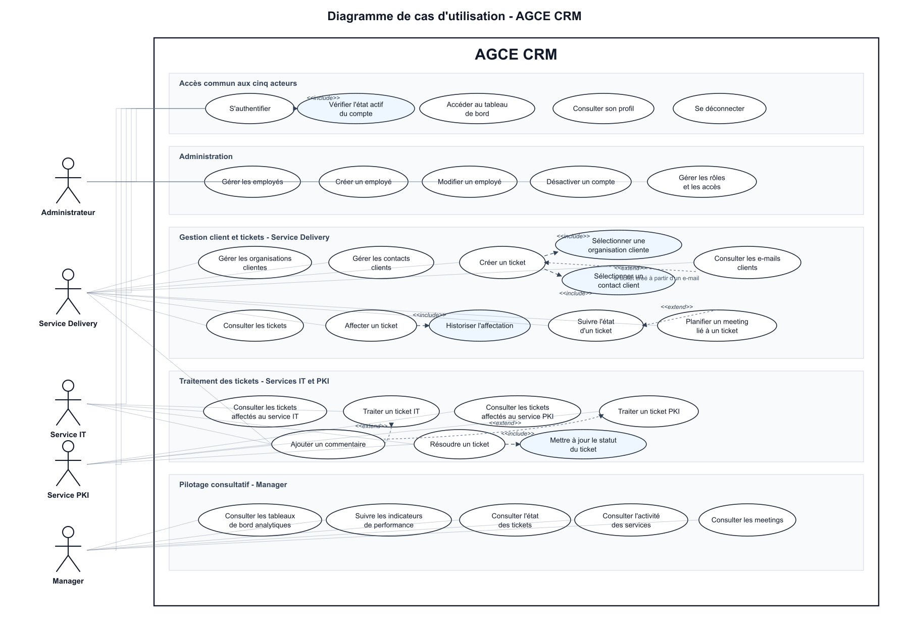

Le diagramme de cas d'utilisation présente les interactions entre les acteurs et les principales fonctionnalités : authentification, gestion des organisations, gestion des contacts, création et affectation des tickets, messagerie, réunions et consultation des tableaux de bord. Il met en évidence la séparation des responsabilités entre l'administrateur, le Service Delivery, le Manager, le service PKI et le service IT.

## 3.8 Description textuelle des cas d'utilisation principaux


| Cas | Acteur principal | Objectif | Précondition | Scénario nominal | Résultat attendu |

|---|---|---|---|---|---|

| S'authentifier | Tous | Accéder à l'application selon le rôle. | L'utilisateur possède un compte actif. | Saisie username/password, vérification backend, génération JWT, redirection. | Accès à la section autorisée. |

| Gérer les employés | ADMIN | Créer, modifier ou désactiver un compte. | ADMIN authentifié. | Saisie des données, validation, hachage du mot de passe, enregistrement. | Compte employé mis à jour. |

| Gérer les organisations | SD | Centraliser les organisations clientes. | SD authentifié. | Création ou modification d'une organisation. | Organisation disponible pour contacts et tickets. |

| Gérer les contacts | SD | Rattacher des interlocuteurs aux organisations. | Organisation existante. | Saisie du contact et association. | Contact enregistré. |

| Créer un ticket | SD | Enregistrer une demande ou un incident. | Organisation ou contexte disponible. | Saisie du ticket, statut Pending, création de room. | Ticket créé et traçable. |

| Affecter un ticket | SD | Orienter le ticket vers IT ou PKI. | Ticket non résolu. | Sélection du service, contrôle backend, historique. | Ticket affecté. |

| Consulter les tickets | Acteur autorisé | Suivre les tickets accessibles. | Utilisateur authentifié. | Chargement de la liste filtrée par rôle. | Tickets affichés. |

| Modifier le statut | SD | Mettre à jour l'état du ticket. | Ticket non résolu. | Choix d'un statut valide. | Statut mis à jour. |

| Ajouter un commentaire | Acteur autorisé | Documenter une action ou décision. | Ticket accessible et non résolu. | Saisie et enregistrement du commentaire. | Historique enrichi. |

| Échanger dans une room | Acteur autorisé | Communiquer autour d'un ticket. | Room accessible. | Connexion Socket.IO, envoi et diffusion. | Message reçu par les membres autorisés. |

| Planifier un meeting | SD | Organiser une réunion de suivi. | Utilisateur et ticket disponibles. | Création du meeting, choix invité/salle. | Meeting enregistré. |

| Consulter le dashboard | Manager / SD / autres rôles | Visualiser les indicateurs. | Utilisateur authentifié. | Chargement des KPI selon rôle. | Indicateurs affichés. |

| Consulter l'inbox e-mail | SD | Voir les demandes reçues par e-mail. | Configuration IMAP disponible. | Synchronisation et affichage des e-mails. | E-mails consultables. |


## 3.9 Diagramme de classes

_Figure 2 : Diagramme de classes du système._

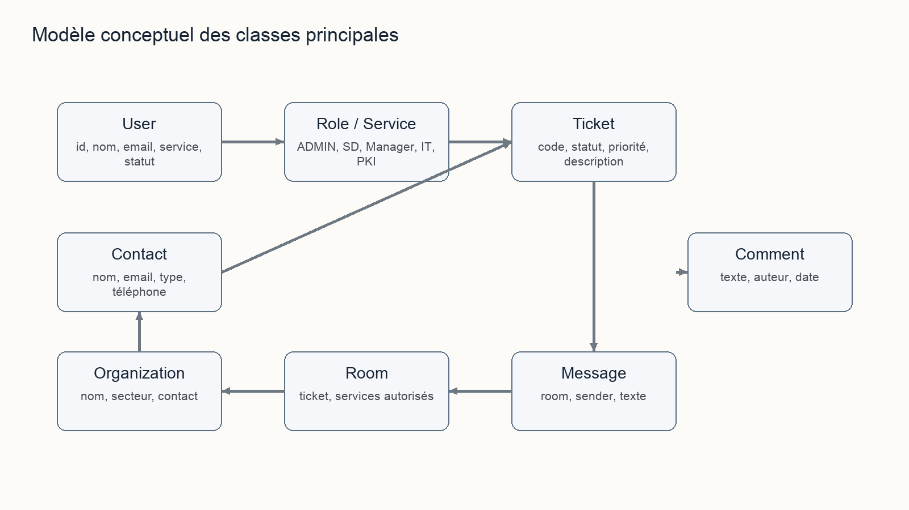

Le diagramme de classes représente la structure statique du système. Il montre les principales entités manipulées par l'application, notamment les employés, services, organisations, contacts, tickets, rooms, messages, commentaires, réunions, salles et e-mails importés.

## 3.10 Description des entités principales


| Entité | Rôle |

|---|---|

| Employee | Représente un utilisateur interne, son identité, son service, son statut et ses informations de connexion. |

| Organization | Représente une organisation cliente ou partenaire. |

| Contact | Représente un interlocuteur rattaché à une organisation. |

| Ticket | Représente une demande ou un incident suivi par le système. |

| Room | Représente l'espace de discussion lié à un ticket. |

| Message | Représente un message envoyé dans une room. |

| Comment | Représente une note structurée liée à un ticket. |

| Meeting | Représente une réunion de suivi avec organisateur, invité et éventuellement ticket. |

| ClientEmail | Représente un e-mail client importé dans l'inbox SD. |

| Attachment | Représente une pièce jointe associée à un e-mail. |

| AssignmentHistory | Représente l'historique d'affectation IT/PKI d'un ticket. |

| Service | Représente un service ou rôle interne rattaché aux employés. |

| MeetingRoom | Représente une salle ou un lieu disponible pour une réunion. |

| Activité récente | Représente un flux calculé à partir des tickets, affectations, commentaires, organisations, contacts et réunions. |


## 3.11 Diagrammes de séquence

_Figure 3 : Flux de traitement d'une demande et d'un ticket._

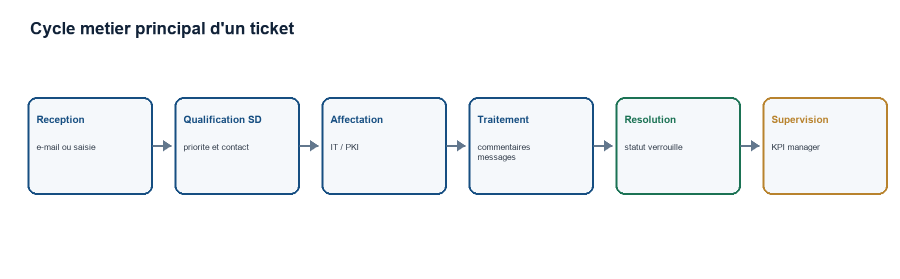

Le flux principal débute par l'authentification de l'utilisateur, se poursuit par la création d'un ticket par le Service Delivery, puis par son affectation éventuelle à IT ou PKI. Les échanges internes sont conservés dans une room associée au ticket, tandis que les commentaires et réunions complètent le suivi jusqu'à la résolution.

_Figure 4 : Diagramme de séquence représentatif._

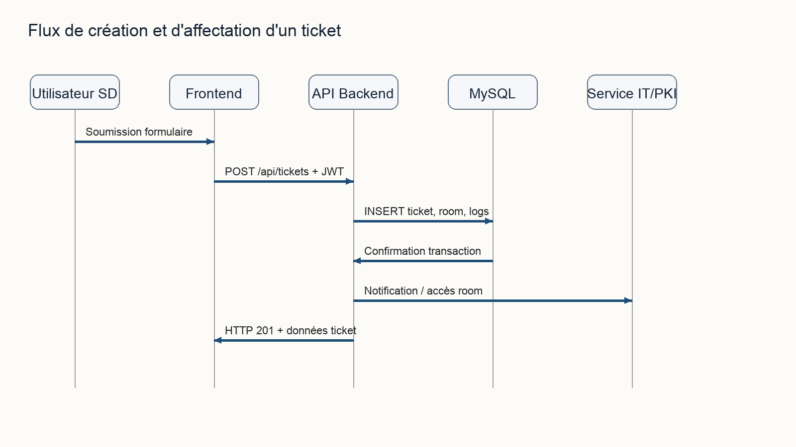

Ce diagramme illustre les échanges entre l'utilisateur, le frontend, l'API Express.js, les services métier et la base MySQL lors d'un scénario représentatif de l'application.

## 3.12 Architecture générale du système

L'architecture générale est de type client-serveur. L'utilisateur interagit avec un frontend React et Vite. Le frontend communique avec l'API Express.js au moyen de requêtes HTTP JSON contenant un token Bearer. Les échanges temps réel sont assurés par Socket.IO. Les services métier appliquent les règles fonctionnelles et les repositories exécutent les requêtes SQL vers MySQL. Un service Gmail IMAP permet d'importer les e-mails entrants du Service Delivery.

_Figure 5 : Architecture générale de l'application AGCE CRM._

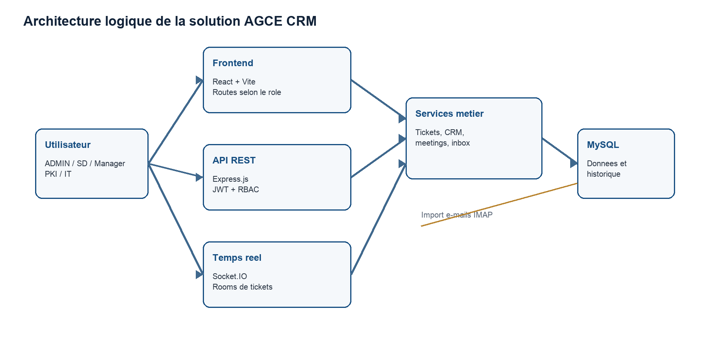

## 3.13 Modèle relationnel

_Tableau 6 : Tables principales de la base de données._

| Table | Rôle dans le système |
|---|---|
| services | Stocke les services internes associés aux employés : SD, IT, PKI, Manager et ADMIN. |
| employees | Stocke les employés, identifiants, mots de passe hachés, services et statuts. |
| organizations | Stocke les organisations clientes ou partenaires. |
| contacts | Stocke les contacts rattachés aux organisations. |
| tickets | Stocke les demandes, statuts, niveaux, contexte et résolution. |
| ticket_assignment_history | Stocke l'historique des affectations ou réaffectations IT/PKI. |
| rooms | Stocke les espaces de discussion associés aux tickets. |
| messages | Stocke les messages envoyés dans les rooms. |
| room_message_reads | Stocke le dernier message lu et la date de lecture par employé. |
| comments | Stocke les commentaires et propositions de résolution liés aux tickets. |
| meeting_rooms | Stocke les salles ou lieux disponibles pour les réunions. |
| meetings | Stocke les réunions de suivi avec organisateur, invité, ticket et salle éventuelle. |
| client_emails | Stocke les e-mails clients importés et rattachés à un contact reconnu. |
| client_email_attachments | Stocke les pièces jointes des e-mails importés. |
| client_email_reads | Stocke l'état de lecture des e-mails par employé. |

Le modèle relationnel repose sur des clés étrangères reliant notamment les employés aux services, les contacts aux organisations, les tickets aux organisations et aux créateurs, les rooms aux tickets, les messages aux rooms, les meetings aux employés, aux tickets et aux salles, ainsi que les e-mails importés aux contacts reconnus.

_Figure 6 : Modèle relationnel de la base de données._

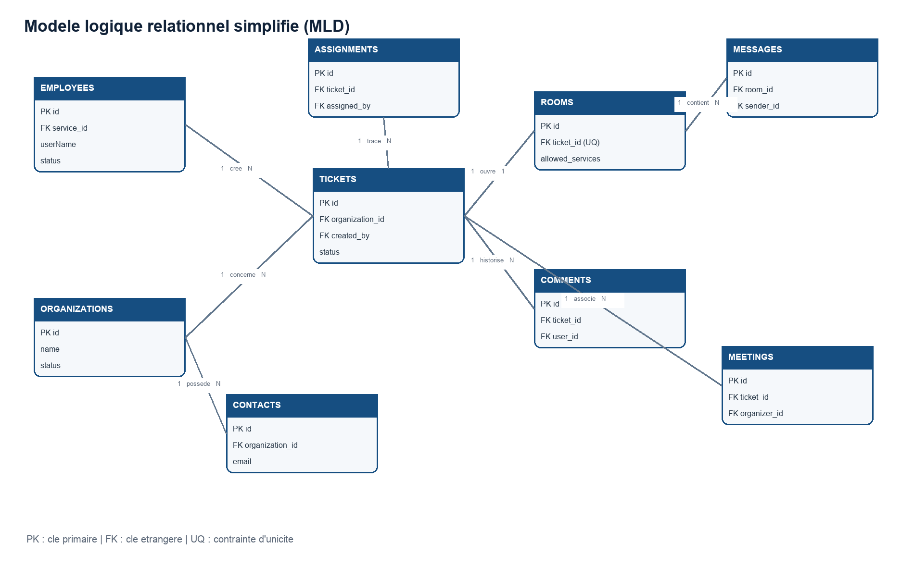

## 3.14 Contrats d'API et intégration système

L'intégration frontend/backend repose sur des routes REST échangeant des données JSON. Les requêtes sécurisées utilisent l'en-tête Authorization avec un Bearer token. Les réponses suivent une structure normalisée indiquant le succès, le message et les données éventuelles. Les erreurs utilisent des codes HTTP adaptés : 400 pour les données invalides, 401 pour l'absence d'authentification, 403 pour l'autorisation refusée, 404 pour une ressource inexistante et 500 pour une erreur serveur.

| Endpoint représentatif | Fonction | Sécurité principale |
|---|---|---|
| POST /api/auth/login | Connexion | Identifiants valides et compte actif |
| GET /api/employees/me | Profil courant | JWT valide |
| POST /api/tickets | Création ticket | Service Delivery |
| GET /api/tickets | Liste des tickets | Filtrage selon le rôle |
| PUT /api/tickets/:ticketId/assign | Affectation IT/PKI | SD, ticket accessible et non résolu |
| PUT /api/tickets/:ticketId/status | Mise à jour du statut | SD, ticket accessible et non résolu |
| PUT /api/tickets/:ticketId/resolve | Clôture avec commentaire de résolution | SD, ticket accessible et non résolu |
| GET /api/tickets/assignment-history/:ticketId | Historique d'affectation | Accès au ticket |
| POST /api/tickets/:ticketId/comments | Ajout commentaire | Accès ticket et non résolu |
| GET /api/rooms | Rooms accessibles | Utilisateur authentifié et autorisé |
| PATCH /api/rooms/:roomId/read | Marquer une room comme lue | Accès à la room |
| GET /api/dashboard/manager | Dashboard manager | Manager |
| GET /api/dashboard/sd | Dashboard Service Delivery | Service Delivery |
| GET /api/client-emails | Inbox e-mail | Service Delivery |
| PATCH /api/client-emails/:emailId/read | Marquer un e-mail comme lu | Service Delivery |
| GET /api/meeting-rooms | Liste des salles de réunion | SD ou Manager |

## 3.15 Conclusion du chapitre

Ce chapitre a présenté l'analyse fonctionnelle et non fonctionnelle, les acteurs, les règles RBAC, les cas d'utilisation, les entités et l'architecture du système. La conception proposée prépare une implémentation modulaire, sécurisée et adaptée aux responsabilités internes de l'AGCE.


---


# Chapitre 4 : Réalisation, implémentation et tests


## 4.1 Introduction du chapitre

Ce chapitre présente la mise en œuvre technique de l'application AGCE CRM. Il décrit l'environnement de développement, l'installation, l'implémentation du frontend, l'implémentation du backend, la sécurité, la messagerie temps réel, l'import des e-mails, la base de données, les tests et les résultats obtenus.


## 4.2 Environnement matériel

| Élément | Description |
|---|---|
| Ordinateur portable | MacBook Air utilisé pour le développement local et les tests manuels. |
| Processeur | Apple M2, 8 cœurs. |
| Mémoire | 8 Go de mémoire unifiée. |
| Système d'exploitation | macOS 26.3.1. |

Cet environnement a permis d'exécuter simultanément le frontend React, l'API Express.js, la base MySQL et les outils de test nécessaires au développement.

## 4.3 Environnement logiciel

_Tableau 7 : Environnement logiciel._


| Outil | Rôle |

|---|---|

| Visual Studio Code | Édition du code frontend et backend. |

| Node.js | Exécution de l'environnement JavaScript. |

| npm | Installation et gestion des dépendances. |

| MySQL Server | Stockage relationnel des données. |

| MySQL Workbench | Consultation et administration de la base. |

| Navigateur web | Exécution et test de l'interface utilisateur. |

| Postman | Test des endpoints API. |

| Git/GitHub | Versionnement et suivi du code. |

| React 19 et Vite | Développement de l’interface utilisateur et lancement du frontend. |

| Express.js | Mise en place de l’API REST. |

| Socket.IO | Messagerie temps réel entre les utilisateurs autorisés. |

| ImapFlow et mailparser | Import et analyse des e-mails clients. |

| bcrypt et JWT | Hachage des mots de passe et authentification des requêtes. |


## 4.4 Installation et configuration

L'installation commence par Node.js et MySQL Server. Une base de données locale nommée ticket_gestion est créée dans MySQL. Le frontend et le backend sont installés séparément avec npm install. Le frontend est lancé avec npm run dev dans le dossier frontend_ticket_gestion, tandis que le backend est lancé avec npm run dev dans le dossier backend_ticket_gestion.

```text
PORT=2300
JWT_SECRET=une_cle_secrete_longue_et_privee
DB_HOST=localhost
DB_NAME=ticket_gestion
DB_USER=utilisateur_mysql
DB_PWD=mot_de_passe_mysql
GMAIL_IMAP_USER=adresse_de_reception_sd@gmail.com
GMAIL_APP_PASSWORD=mot_de_passe_application_gmail
GMAIL_SYNC_INTERVAL_MS=60000
```


## 4.5 Implémentation du frontend

Le frontend est développé avec React et Vite. Il est organisé autour de composants réutilisables, de routes protégées et d'une sidebar adaptée au rôle de l'utilisateur. Le composant RoleBasedRoute vérifie le token, le rôle et l'état actif du compte avant d'autoriser l'accès à une page.

L'interface comprend des dashboards, des formulaires, des listes, des modals, des toasts de notification, des pages d'erreur et une page de refus d'accès. Le thème sombre/clair est géré par des variables CSS et une préférence locale associée à l'utilisateur.


## 4.6 Concepts React utilisés


| Concept | Utilisation dans le projet |

|---|---|

| Composants et props | Découpage de l'interface en blocs réutilisables et transmission des données parent-enfant. |

| useState | Gestion des formulaires, chargements, erreurs, onglet actif, ticket sélectionné, modal et thème. |

| useEffect | Chargement des données, vérification du compte actif, récupération des tickets, connexion à une room Socket.IO, redirection et thème. |

| useRef | Scroll automatique des messages, clic extérieur, connexion socket et room active. |

| useMemo | Mémorisation des filtrages, indicateurs du tableau de bord, tickets filtrés, room sélectionnée et route de retour. |

| useCallback | Mémorisation de joinRoom, sendMessage, loadRooms et chargements partagés. |

| Événements | Gestion des clics, soumissions de formulaires et changements de champs. |

| Affichage conditionnel | Boutons selon rôle, loading, error, état vide, statut ticket, room non lue et onglet actif. |


## 4.7 Implémentation du backend

Le backend repose sur Express.js. Le fichier index.js assure le démarrage du serveur HTTP, l'initialisation de Socket.IO, les schémas complémentaires et le service Gmail. Le fichier app.js monte les routes Express. La connexion MySQL est centralisée dans config/db.js.


| Couche | Responsabilité |

|---|---|

| Routes | Déclaration des endpoints, méthodes HTTP et middlewares. |

| Controllers | Réception des requêtes et formatage des réponses. |

| Services | Règles métier, validations fonctionnelles et orchestration. |

| Repositories | Requêtes SQL vers MySQL. |

| Middlewares | Vérification JWT, rôles, accès aux tickets et blocage des actions interdites. |

| Utils | Réponses API normalisées, blacklist JWT et vérification d’accès aux rooms. |


## 4.8 Authentification et sécurité

La sécurité est un élément central du projet. L'authentification repose sur un nom d'utilisateur et un mot de passe. Les mots de passe sont hachés avec bcrypt. Après vérification, le backend génère un JWT contenant les informations nécessaires à la session. Le token est stocké côté client et envoyé dans l'en-tête Authorization des requêtes protégées.

Le middleware auth.js vérifie le token, son expiration, sa présence dans la blacklist et l'état actif du compte. Les middlewares requireServiceDelivery, requireManager, requireServiceDeliveryOrManager, requireTicketAccess et blockResolvedTicket appliquent les règles d'autorisation. Les erreurs d'authentification et d'autorisation sont distinguées par des codes HTTP tels que 401 pour l'absence de token et 403 pour les droits insuffisants ou le token invalide/expiré selon l'implémentation actuelle.

La sécurité ne repose donc pas uniquement sur le masquage des boutons dans l'interface. Le frontend adapte les routes, le menu et les actions visibles, mais le backend contrôle réellement le rôle, l'accès à la ressource et l'état du ticket.


## 4.9 Messagerie temps réel

La messagerie temps réel utilise Socket.IO. Chaque ticket dispose d'une room de conversation dont l'accès est limité aux services autorisés par le champ allowed_services. Lorsqu'un utilisateur ouvre une conversation, le frontend rejoint la room correspondante. Les messages sont enregistrés en base puis diffusés aux membres connectés. Le système conserve également l'état lu/non lu par employé.


## 4.10 Import des e-mails clients

L'inbox e-mail du Service Delivery est intégrée au système au moyen d'une connexion Gmail IMAP. ImapFlow assure la communication avec la boîte e-mail, tandis que mailparser extrait le sujet, l'expéditeur, le contenu et les pièces jointes. Les e-mails reconnus peuvent être stockés dans MySQL et consultés par l'équipe SD avec un statut lu/non lu individuel. Les messages provenant d'expéditeurs non reconnus peuvent être ignorés afin de ne conserver que les demandes rattachées à des contacts connus.


## 4.11 Base de données

| Table | Rôle |
|---|---|
| services | Services internes et rôles associés aux employés. |
| employees | Comptes internes, identifiants, mot de passe haché, service et statut actif/inactif. |
| organizations | Organisations clientes ou partenaires. |
| contacts | Interlocuteurs rattachés aux organisations. |
| tickets | Demandes et incidents avec statut, niveau, contexte et résolution. |
| ticket_assignment_history | Historique des affectations ou réaffectations IT/PKI. |
| rooms | Espaces de discussion associés aux tickets. |
| messages | Messages envoyés dans les rooms. |
| room_message_reads | Dernier message lu et date de lecture par employé. |
| comments | Commentaires et propositions de résolution liés aux tickets. |
| meeting_rooms | Salles ou lieux disponibles pour les réunions. |
| meetings | Réunions de suivi avec organisateur, invité, ticket et salle éventuelle. |
| client_emails | E-mails clients importés et rattachés à un contact reconnu. |
| client_email_attachments | Pièces jointes des e-mails importés. |
| client_email_reads | État de lecture des e-mails par employé. |

Cette base ne contient pas de table d'audit générale dédiée. L'activité récente affichée dans les tableaux de bord est reconstruite à partir des tables métier existantes, notamment les tickets, affectations, commentaires, organisations, contacts et réunions.

## 4.12 Interfaces principales de l'application

Les interfaces suivantes illustrent les principales fonctionnalités réalisées : authentification, tableaux de bord, création et suivi des tickets, contacts, messagerie et réunions.

_Figure 7 : Interface d'authentification sécurisée._

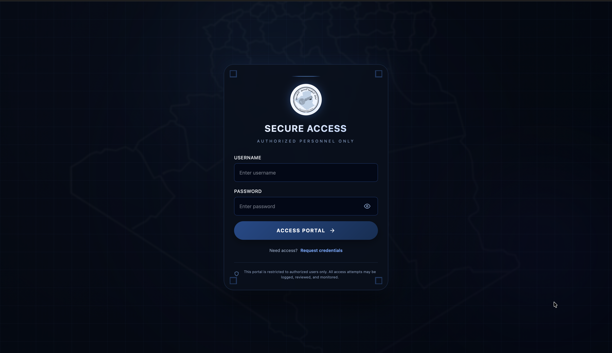

_Figure 8 : Tableau de bord Manager et indicateurs de supervision._

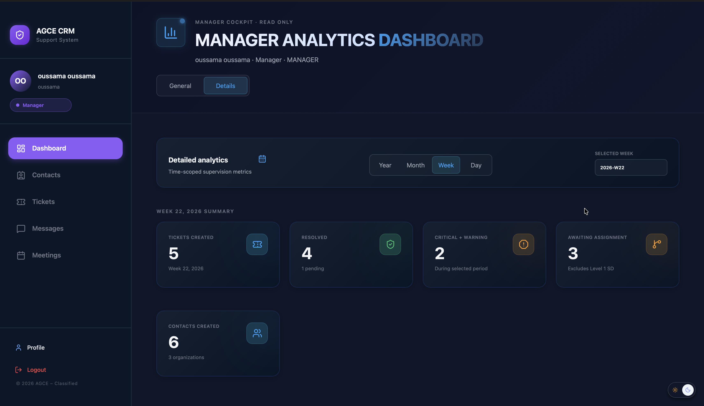

_Figure 9 : Tableau de bord Service Delivery._

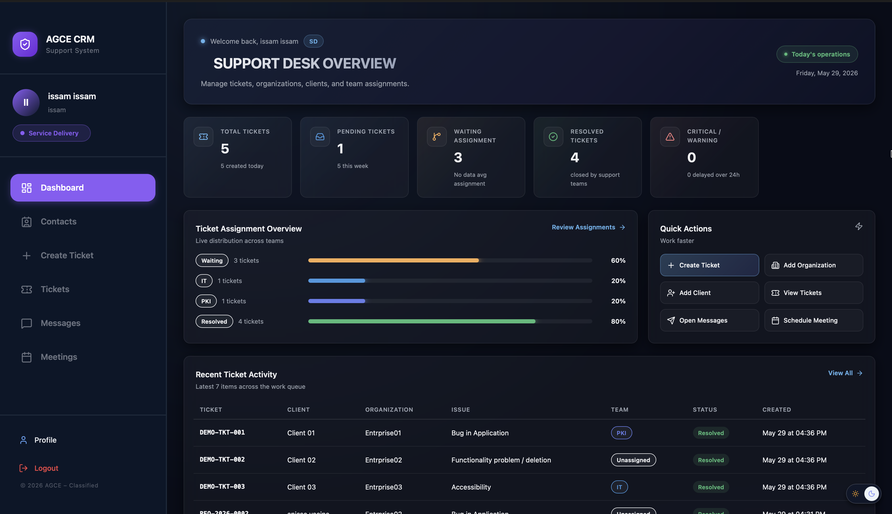

_Figure 10 : Interface de gestion des tickets._

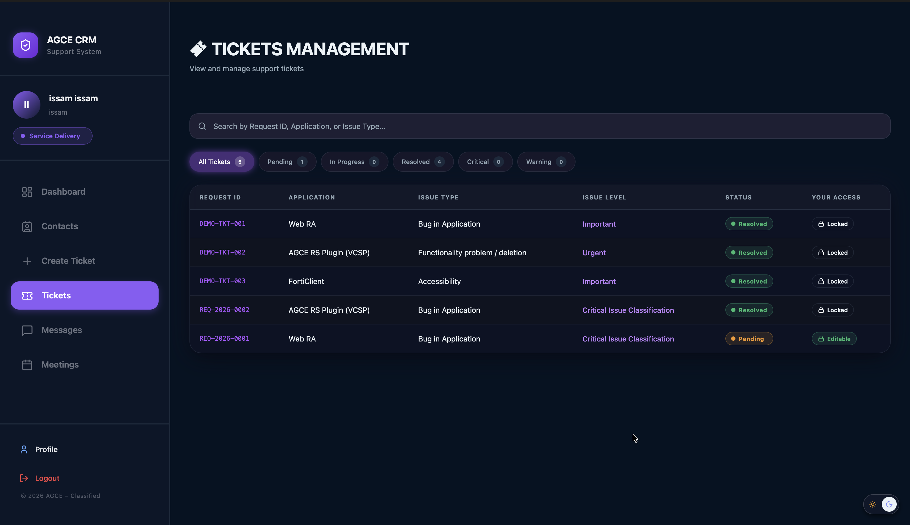

_Figure 11 : Formulaire de création d'un ticket._

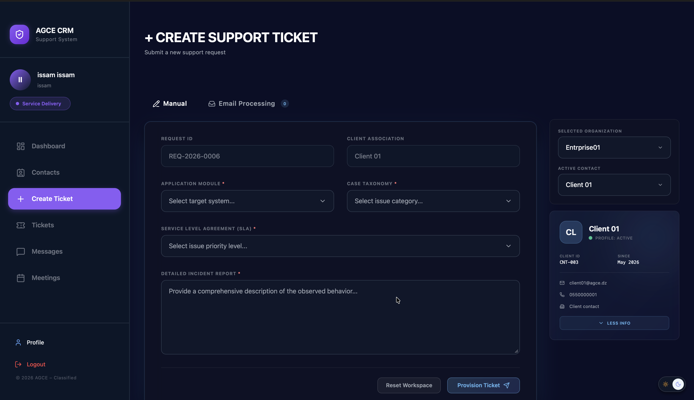

_Figure 12 : Gestion des contacts et organisations._

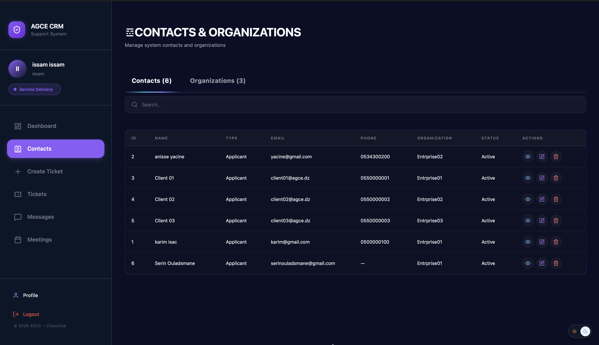

_Figure 13 : Messagerie temps réel liée aux tickets._

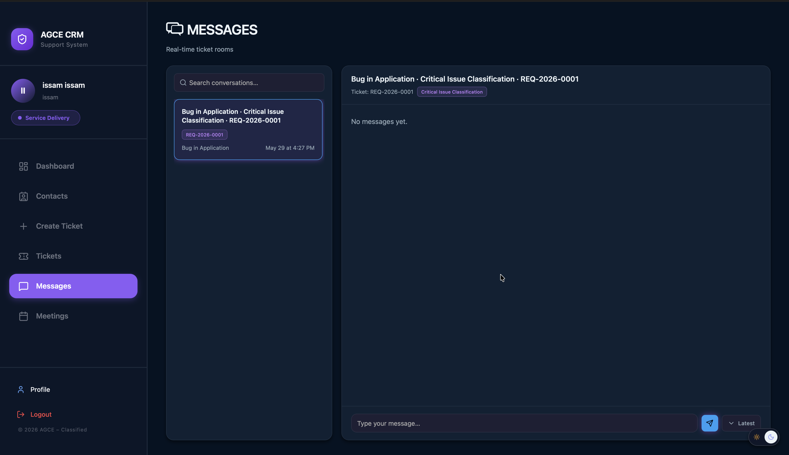

_Figure 14 : Interface des réunions de suivi._

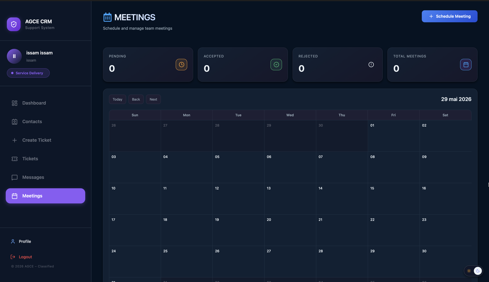

Ces captures montrent que les fonctionnalités sont organisées par rôle et que l'utilisateur accède à une navigation adaptée à ses responsabilités.

## 4.13 Tests fonctionnels

_Tableau 8 : Tests fonctionnels._

| Test | Scénario | Résultat attendu | Résultat obtenu | Preuve ou observation |
|---|---|---|---|---|
| TF01 | Connexion réussie | Accès au dashboard du rôle | Accès obtenu | Redirection vers l'espace autorisé. |
| TF02 | Connexion avec mauvais mot de passe | Refus de connexion | Erreur affichée | Message d'erreur côté interface. |
| TF03 | Accès à une route interdite | Refus d'accès ou redirection | Accès bloqué | Page de refus d'accès ou retour dashboard. |
| TF04 | Désactivation d'un employé | Compte refusé | Session bloquée | Vérification du statut actif côté backend. |
| TF05 | Création d'organisation | Organisation enregistrée | Liste actualisée | Vérification dans l'interface et en base. |
| TF06 | Création de contact | Contact associé à une organisation | Contact visible | Association organisation/contact confirmée. |
| TF07 | Création de ticket | Ticket Pending créé et room associée | Ticket et room créés | Ticket visible dans la liste et room disponible. |
| TF08 | Affectation IT/PKI | Historique enregistré | Service affecté | Historique d'affectation consultable. |
| TF09 | Modification du statut | Statut mis à jour | Statut actualisé | Changement visible dans l'interface. |
| TF10 | Ajout de commentaire | Commentaire conservé | Historique enrichi | Commentaire affiché dans le détail du ticket. |
| TF11 | Envoi de message | Diffusion temps réel | Message reçu | Message diffusé dans la room autorisée. |
| TF12 | Création de réunion | Réunion Pending créée | Réunion enregistrée | Réunion visible dans l'interface meetings. |
| TF13 | Consultation dashboard | Indicateurs affichés | KPI visibles | Données agrégées selon le rôle. |

## 4.14 Tests de sécurité

_Tableau 9 : Tests de sécurité._

| Test | Scénario | Résultat attendu | Résultat obtenu | Observation |
|---|---|---|---|---|
| TS01 | Accès sans token | Refus 401 | Requête refusée | Le middleware exige un token. |
| TS02 | Token invalide | Refus 403 | Requête refusée | Le backend rejette le token invalide. |
| TS03 | Token expiré | Refus 403 ou redirection login | Accès refusé | Le frontend peut renvoyer vers la connexion. |
| TS04 | Compte désactivé | Refus 403 | Accès bloqué | Le statut actif est vérifié en base. |
| TS05 | Rôle non autorisé | Refus 403 | Action interdite | Exemple : PKI tentant de créer un ticket. |
| TS06 | Modification d'un ticket résolu | Blocage | Action refusée | Commentaire ou changement de statut bloqué. |
| TS07 | Accès PKI à un ticket IT | Refus | Accès interdit | Vérification des services autorisés. |
| TS08 | Accès IT à un ticket PKI | Refus | Accès interdit | Vérification des services autorisés. |
| TS09 | Appel manuel d'une route protégée | Message clair | Erreur retournée | Contrôle appliqué côté backend. |

## 4.15 Résultats obtenus

Les résultats obtenus montrent que l'application couvre le cycle principal d'une demande : réception, création du ticket, affectation, suivi, échanges internes, réunion et résolution. Le système offre également des tableaux de bord adaptés aux rôles et conserve les informations nécessaires au suivi opérationnel.

Sur le plan technique, l'architecture sépare clairement l'interface React, l'API Express.js, les services métier, les repositories SQL et la base MySQL. Les contrôles d'accès appliqués côté backend renforcent la fiabilité de la solution et réduisent le risque de contournement des règles visibles dans l'interface.

## 4.16 Difficultés rencontrées

La définition des permissions par rôle a constitué une difficulté importante, car chaque acteur ne devait accéder qu'aux données correspondant à ses responsabilités. Cette difficulté a été traitée par des routes protégées côté frontend et par des middlewares côté backend.

La synchronisation entre le frontend et le backend a également demandé une attention particulière. Les composants React devaient respecter les contrats d'API, gérer les erreurs et afficher des retours clairs à l'utilisateur.

La messagerie temps réel a nécessité une gestion précise des rooms, des droits d'accès et des états de lecture. Socket.IO a permis de diffuser les messages, tandis que MySQL conserve l'historique.

L'intégration Gmail IMAP a aussi présenté des contraintes liées à la configuration, aux expéditeurs reconnus et aux pièces jointes. Cette partie a été isolée dans un module spécifique afin de limiter son impact sur le reste de l'application.

## 4.17 Limites du projet

Le projet présente certaines limites. Les tests ont été principalement réalisés de manière manuelle et doivent être complétés par des tests automatisés. L'application n'a pas encore été évaluée sur un grand volume de données en production. La blacklist JWT est actuellement en mémoire et devrait être remplacée par un mécanisme persistant. Le monitoring, les sauvegardes automatiques, l'authentification multifactorielle, les statistiques prédictives et le déploiement industriel restent à renforcer. L'activité récente du tableau de bord est actuellement reconstruite à partir de plusieurs tables métier et non stockée dans une table d'audit dédiée.


## 4.18 Conclusion du chapitre

Ce chapitre a présenté la réalisation technique de l'application AGCE CRM, son environnement, son implémentation, ses mécanismes de sécurité et ses tests. Les résultats confirment que la solution répond aux besoins principaux, tout en laissant des perspectives d'amélioration pour une version plus industrialisée.


---


# Conclusion générale et perspectives

Ce travail a permis de concevoir et de réaliser une application web adaptée au suivi des demandes et incidents de l'AGCE. Le projet s'inscrit dans un contexte où la confiance numérique, la protection des informations et le contrôle d'accès constituent des exigences importantes.

L'application obtenue regroupe les fonctions essentielles de gestion des organisations, contacts, tickets, échanges internes, réunions et tableaux de bord. Elle applique une séparation des rôles entre ADMIN, Service Delivery, Manager, PKI et IT, tout en conservant les informations nécessaires au suivi opérationnel.

Le travail réalisé couvre l'analyse du besoin, l'étude de l'existant, la conception, l'implémentation frontend et backend, la base de données, la messagerie temps réel, l'inbox e-mail, les tableaux de bord et les tests. Il montre qu'une solution locale peut répondre aux besoins spécifiques de l'organisme tout en restant évolutive.

Les limites du projet concernent principalement l'absence de tests à grande échelle, l'industrialisation encore incomplète, le besoin d'un monitoring avancé, la persistance de la blacklist JWT et le renforcement des mécanismes de sécurité.


## Perspectives

- intégrer une authentification multifactorielle ;

- préparer un déploiement en production ;

- mettre en place des sauvegardes automatiques ;

- ajouter du monitoring et de la journalisation avancée ;

- générer des rapports PDF ou Excel ;

- améliorer la recherche avancée ;

- ajouter des notifications en temps réel ;

- renforcer l'intégration des e-mails ;

- améliorer les dashboards et les indicateurs prédictifs ;

- mettre en place une gestion avancée des SLA ;

- rendre persistante ou distribuée la blacklist JWT.


---


# Bibliographie

1. République Algérienne Démocratique et Populaire. Loi n° 15-04 relative à la signature et à la certification électroniques.

1. République Algérienne Démocratique et Populaire. Décret exécutif n° 16-135 du 25 avril 2016 fixant l'organisation et le fonctionnement de l'AGCE.

1. React. Documentation officielle de React. https://react.dev/

1. Vite. Documentation officielle de Vite. https://vite.dev/

1. Express.js. Documentation officielle d'Express. https://expressjs.com/

1. MySQL. Documentation officielle de MySQL. https://dev.mysql.com/doc/

1. Socket.IO. Documentation officielle de Socket.IO. https://socket.io/docs/

1. JWT.io. Introduction aux JSON Web Tokens. https://jwt.io/

1. bcrypt. Documentation du module bcrypt pour Node.js. https://www.npmjs.com/package/bcrypt

1. OWASP Foundation. Authentication Cheat Sheet. https://cheatsheetseries.owasp.org/

1. OWASP Foundation. Authorization Cheat Sheet. https://cheatsheetseries.owasp.org/

1. Sandhu, R. S., Coyne, E. J., Feinstein, H. L., & Youman, C. E. (1996). Role-Based Access Control Models. Computer, 29(2), 38-47.

1. Buttle, F., & Maklan, S. (2019). Customer Relationship Management: Concepts and Technologies. Routledge.

1. AXELOS. ITIL Foundation: ITIL 4 Edition. The Stationery Office.

1. Jira Service Management. Documentation officielle. https://support.atlassian.com/jira-service-management-cloud/

1. Zendesk. Documentation officielle. https://support.zendesk.com/

1. GLPI Project. Documentation officielle. https://glpi-project.org/documentation/

1. osTicket. Documentation officielle. https://docs.osticket.com/


---


# Annexes

## Annexe A : Hiérarchie et structure interne de l'AGCE

Cette annexe présente la structure fonctionnelle retenue dans le cadre du projet. Le système concerne principalement le Service Delivery, le service PKI, le service IT, le Manager et l'Administrateur. Cette distinction permet de relier les responsabilités métier aux droits d'accès applicatifs.

| Acteur / service | Intervention dans l'application |
|---|---|
| Service Delivery | Réception des demandes, gestion des organisations et contacts, création et affectation des tickets. |
| PKI | Traitement des tickets liés aux certificats et opérations PKI. |
| IT | Traitement des incidents techniques ou applicatifs. |
| Manager | Consultation globale, supervision et analyse des indicateurs. |
| Administrateur | Gestion des comptes employés et accès au tableau de bord administrateur. |

## Annexe B : Produits, solutions et services de l'AGCE

L'AGCE intervient dans les services de certification électronique, de signature numérique, d'authentification, de gestion des certificats, de publication des certificats, de listes de révocation, de vérification et d'horodatage. Ces services s'inscrivent dans la construction de la confiance numérique au niveau gouvernemental.

## Annexe C : Cadre réglementaire et souveraineté des données

La certification électronique et la signature électronique nécessitent un cadre réglementaire, des mécanismes de sécurité et une protection rigoureuse des données. Dans ce contexte, la souveraineté des données justifie le choix d'une solution locale, contrôlée et adaptée aux responsabilités de l'organisme.

## Annexe D : Diagrammes UML complémentaires

_Figure A.1 : Cas d'utilisation de l'application._


_Figure A.2 : Modèle relationnel de la base de données._


_Figure A.3 : Cycle de traitement d'un ticket._


_Figure A.4 : Diagramme de déploiement de l'application._

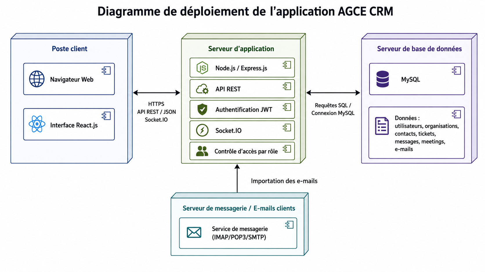

## Annexe E : Captures d'écran supplémentaires

_Figure E.1 : Architecture globale présentée dans le document de réalisation._

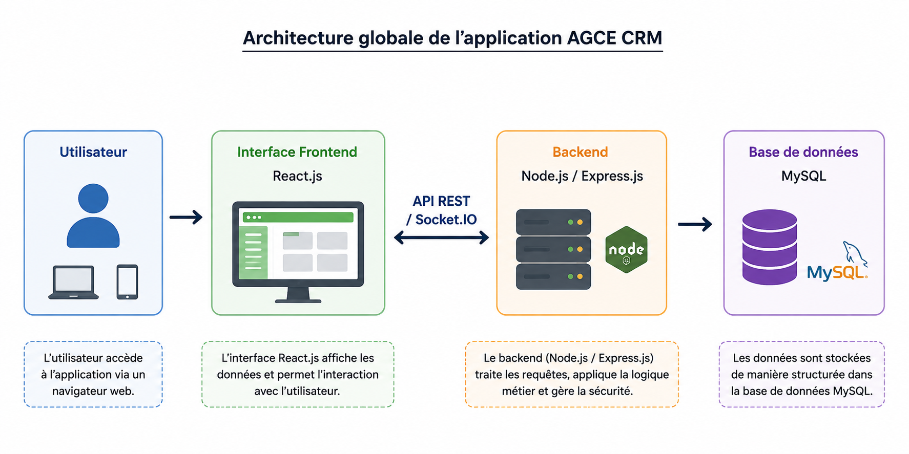

_Figure E.2 : Flux de communication entre frontend et backend._

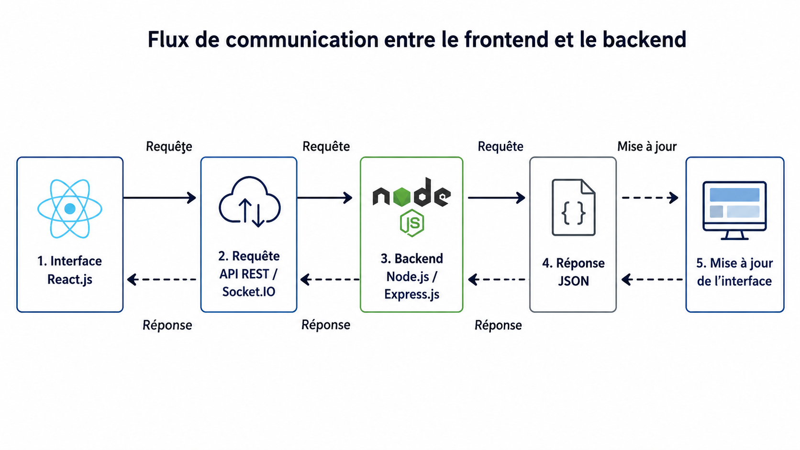

_Figure E.3 : Arborescence du backend._

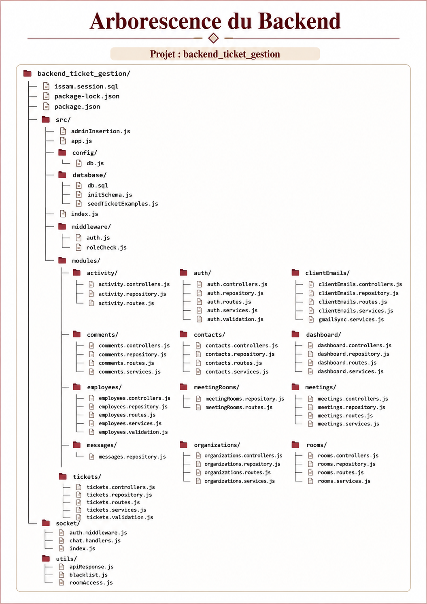

_Figure E.4 : Arborescence du frontend._

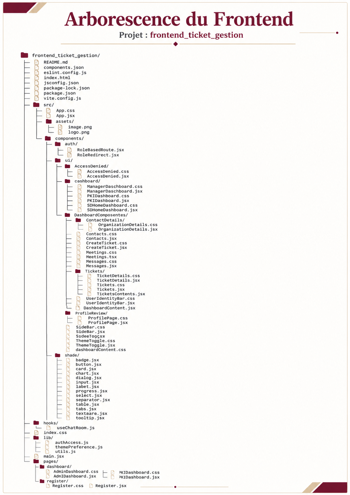

_Figure E.5 : Détail d'un ticket et suivi de résolution._

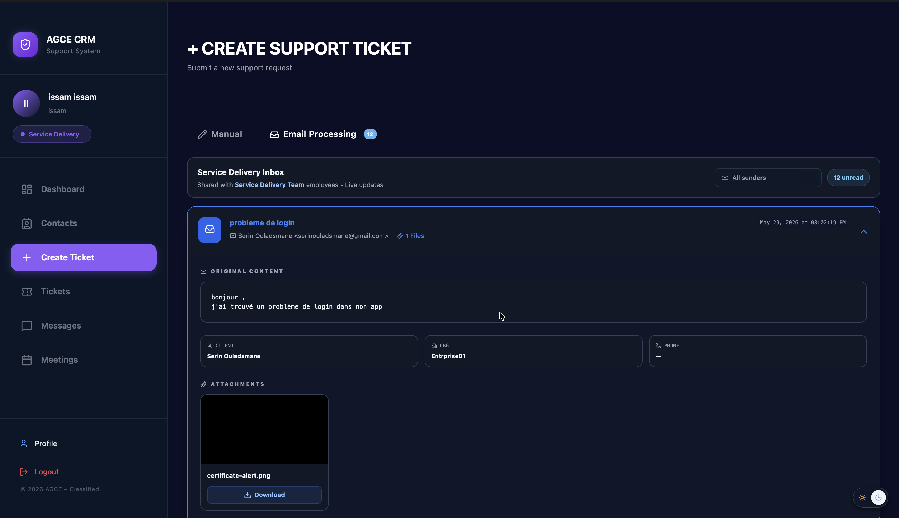

## Annexe F : Extraits de code importants

### Route d'authentification

```javascript
router.post("/login", authController.login);
router.post("/logout", authController.logout);
```

Cet extrait montre que l'authentification est centralisée dans le module `auth` du backend.

### Middleware JWT

```javascript
const authHeader = req.headers.authorization;
const token = authHeader && authHeader.split(' ')[1];

if (!token) {
  return sendError(res, 401, "Access token required");
}

try {
  user = jwt.verify(token, JWT_SECRET);
} catch {
  return sendError(res, 403, "Invalid or expired token");
}
```

Le middleware vérifie la présence du token, sa validité et l'état actif du compte avant d'autoriser l'accès aux routes protégées.

### Contrôle RBAC

```javascript
const roleCheck = (allowedServices) => {
  return (req, res, next) => {
    const service = normalizeService(req.user.service);
    if (!allowedServices.map(normalizeService).includes(service)) {
      return sendError(res, 403, ACCESS_DENIED_MESSAGE);
    }
    req.user.service = service;
    next();
  };
};
```

Ce contrôle limite chaque route aux services ou rôles autorisés.

### Exemple SQL : table tickets

```sql
CREATE TABLE IF NOT EXISTS tickets (
  id INT AUTO_INCREMENT PRIMARY KEY,
  request_code VARCHAR(50) NOT NULL UNIQUE,
  organization_id INT NULL,
  application VARCHAR(255) NOT NULL,
  issue_type VARCHAR(255) NOT NULL,
  issue_level VARCHAR(255) NOT NULL,
  issue_description TEXT NOT NULL,
  status ENUM('Pending', 'In Progress', 'Warning', 'Critical', 'Resolved') DEFAULT 'Pending',
  created_by INT NOT NULL
);
```

Cette table représente le cœur fonctionnel du système de gestion des demandes et incidents.

### Composant RoleBasedRoute

```javascript
if (!allowedRoles.includes(access.role)) {
  return <AccessDenied userRole={access.role} />;
}

return children;
```

Ce composant protège les pages frontend selon le rôle de l'utilisateur.

### Hook useChatRoom

```javascript
const socket = io(SOCKET_URL, {
  autoConnect: false,
  auth: { token },
});

socket.emit("join_room", { roomId }, (response) => {
  if (!response?.success) reject(new Error(response?.error));
  resolve(response);
});
```

Ce hook gère la connexion Socket.IO, l'accès à une room et l'envoi des messages en temps réel.
