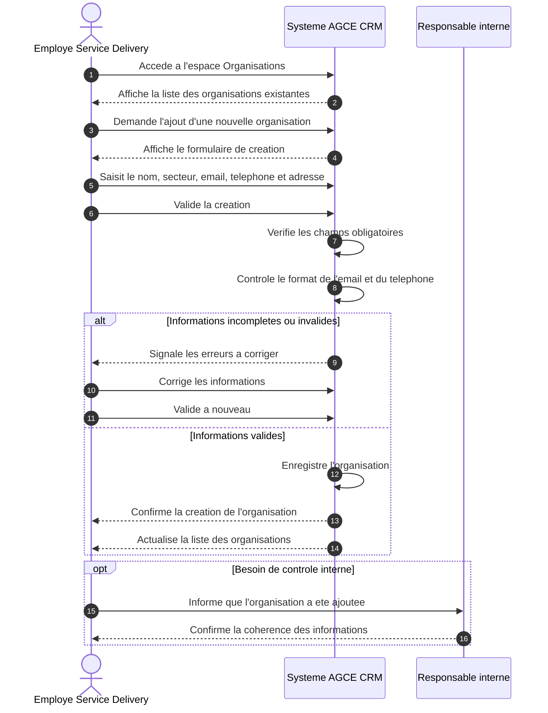
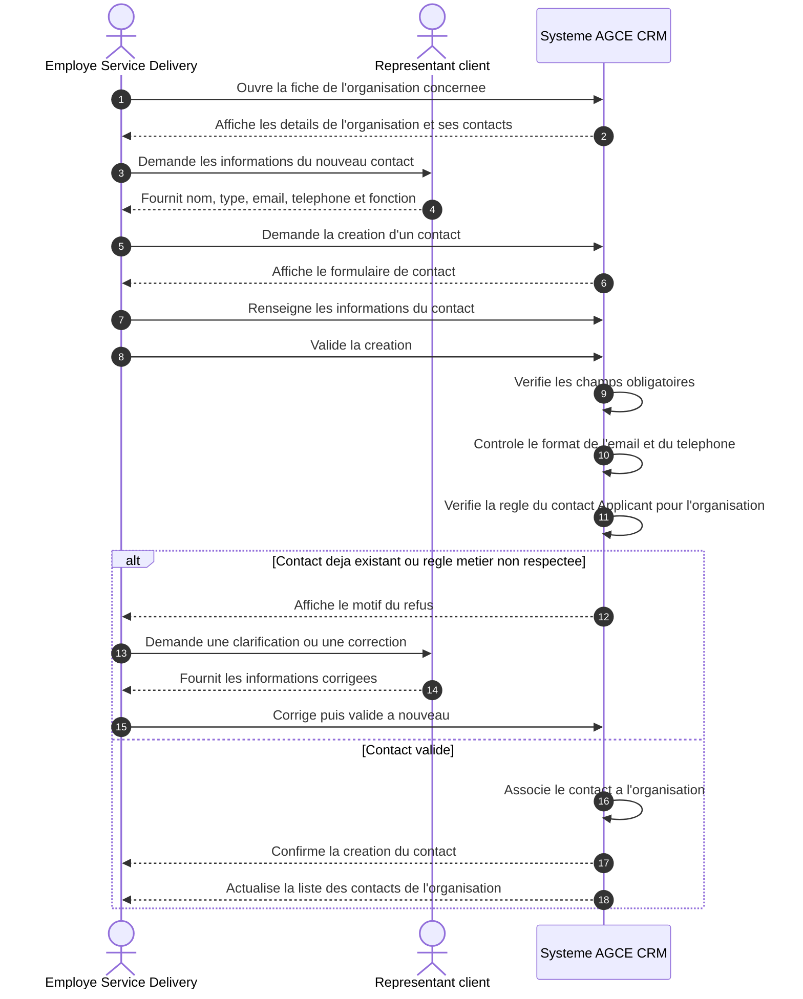
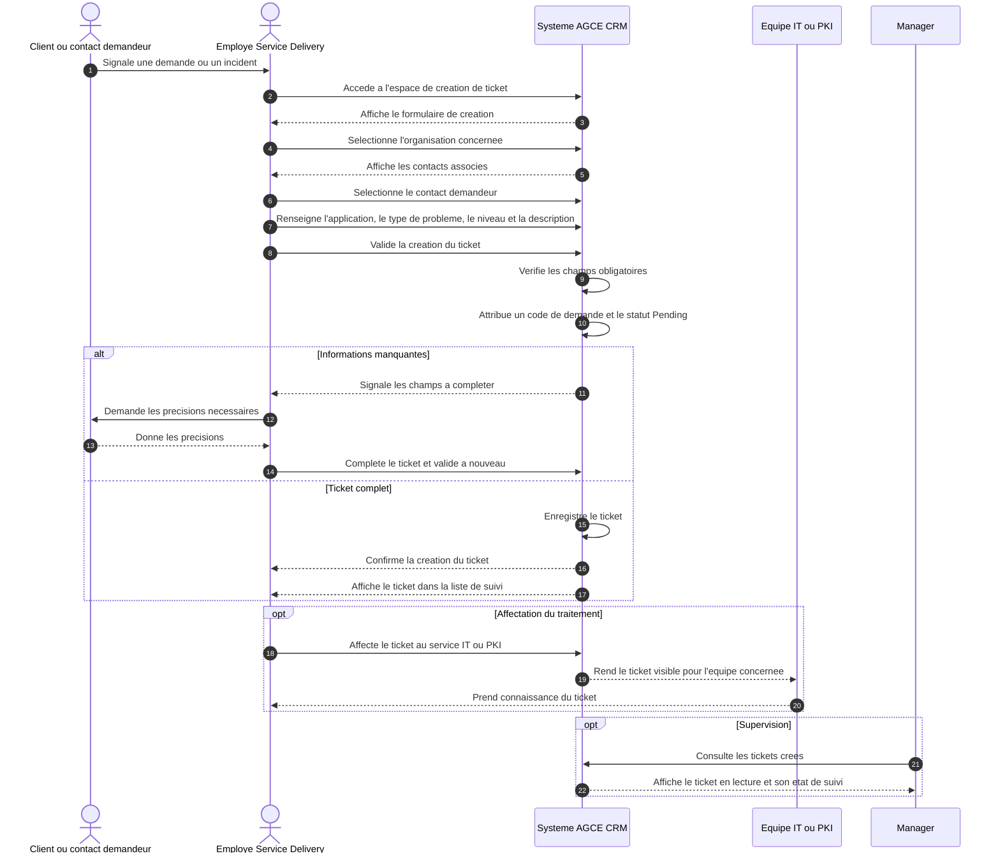
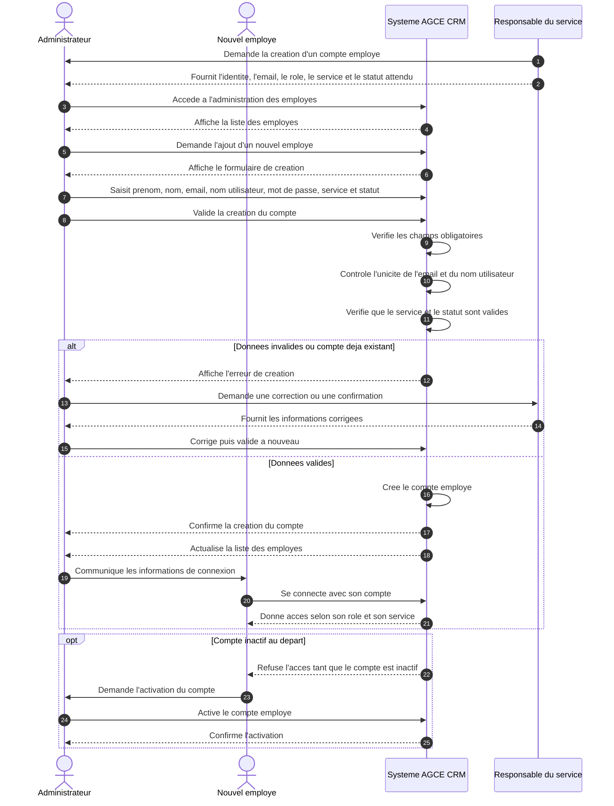

# Diagrammes de sequence - interactions humaines

Ces diagrammes de sequence decrivent les interactions metier du systeme AGCE CRM.
Ils evitent volontairement les details techniques comme le frontend, le backend, les API ou la base de donnees.

## 1. Creation d'une organisation

## 2. Creation d'un contact

## 3. Creation d'un ticket

## 4. Creation d'un employe

